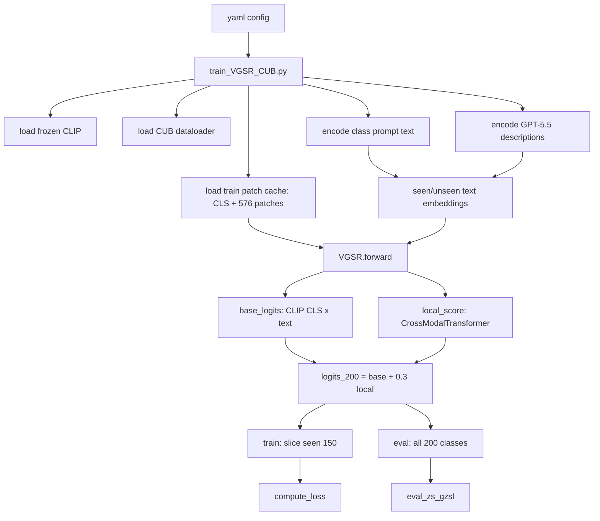

# DVSR 当前代码框架学习版

本文档面向“读代码学习”和“复现实验”两个目标：不只说明某段代码在哪一行，而是把关键代码摘出来，解释它为什么这样写、输入输出张量是什么、当前 H=72.95 配置实际走哪条路径。

对应当前源码：

- `config/VGSR_cub_gzsl.yaml`
- `train_VGSR_CUB.py`
- `model/MyModel.py`
- `tools/helper_func.py`

当前主路径一句话：

> CLIP 冻结提特征，GPT-5.5 文本做类原型；seen 文本经过 Adapter；视觉 patch 经过 FAE；CrossModalTransformer 同时跑 v2s 和 s2v 两条分支；最终使用 add 模式：`logits_200 = base_logits + 0.3 * local_score`；训练时只切 seen 150 类做 CE，评估时在 200 类全空间 argmax。

---

## 1. 当前 H=72.95 配置实际生效开关

下面不是完整 yaml，而是这条强基线真正相关的核心配置。

```yaml
dataset:
  value: CUB
num_class:
  value: 200
dim_f_clip:
  value: 768
device:
  value: cuda:0
batch_size:
  value: 64
epochs:
  value: 20
random_seed:
  value: 5

text_source:
  value: gpt55

adapter_ratio:
  value: 0.2

tf_common_dim:
  value: 512
tf_heads:
  value: 4
tf_dropout:
  value: 0.1

weight_s2v:
  value: 0.5
local_weight:
  value: 0.3

pool_method:
  value: mean
pool_dynamic:
  value: fixed

use_lastvit_cls:
  value: False

gating:
  value: fixed
gating_dynamic:
  value: fixed
weight_s2v_mode:
  value: fixed

score_mode:
  value: add
use_fae:
  value: True

lambda_cal:
  value: 0.0
lambda_consist:
  value: 0.05
consist_dynamic:
  value: True
consist_dynamic_gamma:
  value: 0.1
lambda_topo_pearson:
  value: 0.05
lambda_msdn:
  value: 0.05

use_conditional_text:
  value: True
conditional_text_ratio:
  value: 0.005
meta_net_hidden:
  value: 48

resume_from:
  value: ''
resume_lr_schedule:
  value: finetune
extra_epochs:
  value: 0
finetune_lr:
  value: 0.0001

lr_stages:
  value: null
```

解释重点：

- `score_mode: add`：当前不是 cosine-only，CrossModalTransformer 只作为 CLIP base 的补丁分支。
- `gating: fixed` + `local_weight: 0.3`：最终融合固定为 `base_logits + 0.3 * local_score`。
- `pool_method: mean`：s2v 分支对 576 个 patch 直接平均池化，这是当前最稳的池化。
- `use_conditional_text: True`：G3 条件文本开启，但只扰动 seen 类文本，不动 unseen 类文本。
- `lambda_consist/topo/msdn` 都是 `0.05`：当前生效 loss 是 `CE + Cons + Topo + MSDN`。
- `lr_stages: null`：多段训练代码已经有了，但默认关闭。不开时仍然走 `epochs + extra_epochs` 的旧逻辑。

---

## 2. 总数据流



一句更直白的话：

训练时模型只看 seen 类标签，但 forward 里已经构造了 200 类分数；loss 主要监督 seen 切片，评估时再拿完整 200 类去竞争。

---

## 3. 训练入口：从 yaml 到模型

### 3.1 读取 yaml 并扁平化

`config/VGSR_cub_gzsl.yaml` 的每个参数大多写成：

```yaml
batch_size:
  value: 64
```

训练脚本用这段代码把它变成 `config.batch_size == 64`：

```python
with open('./config/VGSR_cub_gzsl.yaml', 'r', encoding='utf-8') as f:
    config = yaml.safe_load(f)
config = {
    k: v['value'] if isinstance(v, dict) and 'value' in v else v
    for k, v in config.items()
}
config = SimpleNamespace(**config)
```

学习点：

- yaml 里用 `{key: {value: xxx}}` 是为了写注释和扩展元信息。
- 进入 Python 后统一压平成 `SimpleNamespace`，后续可以 `getattr(config, 'xxx', default)`。

### 3.2 CLIP 冻结

```python
clip_model, _ = clip.load("ViT-L/14@336px", device=config.device)
clip_model = clip_model.float()
clip_model.eval()
for p in clip_model.parameters():
    p.requires_grad = False
```

这说明 CLIP 只当特征提取器和文本编码器：

- 图像端：提前缓存 CLS 和 patch features。
- 文本端：编码类名 prompt / GPT 描述。
- 训练时不更新 CLIP 本体。

### 3.3 训练图像缓存

当前最重要的是 patch cache 模式：

```python
HAS_PATCH_CACHE = (
    os.path.exists(CACHE_TRAIN_PATCH)
    and os.path.exists(CACHE_TRAIN_LABEL)
)

elif HAS_PATCH_CACHE:
    train_patches = torch.load(CACHE_TRAIN_PATCH, map_location='cpu', weights_only=True)
    train_labels  = torch.load(CACHE_TRAIN_LABEL, map_location=config.device, weights_only=True)
    train_cls = torch.load(CACHE_TRAIN_FEAT, map_location='cpu', weights_only=True) \
        if HAS_CLS_CACHE else None

    train_patches = train_patches.pin_memory()
    if train_cls is not None:
        train_cls = train_cls.pin_memory()

    USE_CACHE = 'patch'
```

张量形状：

- `train_cls`: `[7057, 768]`
- `train_patches`: `[7057, 576, 768]`
- `train_labels`: `[7057]`

为什么 patch cache 很关键：

- FAE 和 CrossModalTransformer 需要 576 个 patch token。
- 只用 CLS 会退化成没有空间细节的兼容模式。
- patch 存 CPU float16，每 step 切一批搬到 GPU，减轻显存常驻压力。

### 3.4 文本特征：类名 prompt 与 GPT 描述

类名 prompt：

```python
class_names = [c.split('.')[-1].replace("_", " ") for c in dataloader.class_names]
prompts = [f"a photo of a {c}, a type of bird." for c in class_names]
text_inputs = torch.cat([clip.tokenize(p) for p in prompts]).to(config.device)
with torch.no_grad():
    class_text_embeds = clip_model.encode_text(text_inputs).float()
```

GPT 描述编码：

```python
def _encode_descriptions(file_path, dataloader, clip_model, device, class_text_embeds):
    sentences_dict = torch.load(file_path, map_location='cpu', weights_only=False)
    embeds_list = []
    hit = 0
    for cls_name in dataloader.class_names:
        gpt_key = '.'.join(cls_name.split('.')[1:]).lower()
        if gpt_key in sentences_dict:
            sentences = sentences_dict[gpt_key]
            tokens = torch.cat([clip.tokenize(s) for s in sentences]).to(device)
            with torch.no_grad():
                feats = clip_model.encode_text(tokens).float()
            embeds_list.append(feats.mean(dim=0))
            hit += 1
        else:
            idx = dataloader.class_names.index(cls_name)
            embeds_list.append(class_text_embeds[idx])
    return torch.stack(embeds_list), hit, len(sentences_dict)
```

学习点：

- 每类有多句 GPT 描述，CLIP 编码后取平均，得到 `[200, 768]`。
- 如果某类 GPT 描述缺失，就 fallback 到类名 prompt embedding。
- 当前 `text_source: gpt55`，所以使用 `data/gpt4_data/cub_gpt55.pt`。

### 3.5 seen / unseen 文本传入模型

```python
seen_gpt_embeds = gpt_text_embeds[dataloader.seenclasses] \
    if gpt_text_embeds is not None else class_text_embeds[dataloader.seenclasses]

unseen_clip_embeds = gpt_text_embeds[dataloader.unseenclasses] \
    if gpt_text_embeds is not None else class_text_embeds[dataloader.unseenclasses]

model = VGSR(
    config,
    dataloader.seenclasses,
    dataloader.unseenclasses,
    seen_text_embeds=seen_gpt_embeds,
    unseen_text_embeds=unseen_clip_embeds,
).to(config.device)
```

注意这里的变量名 `unseen_clip_embeds` 有历史命名味道；当前逻辑下如果 `gpt_text_embeds` 存在，unseen 也会用 GPT 描述 embedding，而不是类名 prompt。

---

## 4. 优化器、续训和多段训练

### 4.1 默认 optimizer + scheduler

```python
optimizer = optim.Adam(model.parameters(), lr=0.001, weight_decay=1e-4)
scheduler = optim.lr_scheduler.CosineAnnealingLR(optimizer, T_max=config.epochs)
```

这是头训默认：

- Adam
- 初始学习率 `1e-3`
- weight decay `1e-4`
- cosine 周期长度等于 `config.epochs`

### 4.2 `finetune` 模式

当前代码已经支持 `finetune_lr`：

```python
elif resume_lr_schedule == 'finetune':
    finetune_lr = float(getattr(config, 'finetune_lr', 1e-4))
    for g in optimizer.param_groups:
        g['lr'] = finetune_lr
    scheduler = optim.lr_scheduler.CosineAnnealingLR(
        optimizer, T_max=config.epochs)
```

重要理解：

- `finetune` 会加载模型权重。
- 不会恢复旧 optimizer momentum/variance。
- 会把 lr 设置为 `finetune_lr`。
- 仍然会新建 cosine scheduler，不是严格 constant lr。

如果你要 `20 + 10`：

```yaml
# 第一段
epochs:
  value: 20
resume_from:
  value: ''
extra_epochs:
  value: 0

# 第二段
epochs:
  value: 10
resume_from:
  value: auto
resume_lr_schedule:
  value: finetune
finetune_lr:
  value: 0.0001
extra_epochs:
  value: 0
```

不要写成 `epochs: 20, extra_epochs: 10`，因为当前代码会算：

```python
total_epochs = config.epochs + extra_epochs
```

那样会跑 30 个 epoch，而不是 10 个 epoch。

### 4.3 一键多段训练 `lr_stages`

当前代码已经有这个功能：

```python
lr_stages = getattr(config, 'lr_stages', None) or []
stage_boundaries = []
if lr_stages:
    cum = 0
    for i, st in enumerate(lr_stages):
        cum += int(st['epochs'])
        stage_boundaries.append(cum)
    total_epochs = stage_boundaries[-1]

    first = lr_stages[0]
    for g in optimizer.param_groups:
        g['lr'] = float(first['lr'])
    scheduler = optim.lr_scheduler.CosineAnnealingLR(
        optimizer, T_max=int(first['epochs']))
```

每个 stage 结束时切下一段：

```python
if lr_stages and epoch in stage_boundaries and epoch < total_epochs:
    next_idx = stage_boundaries.index(epoch) + 1
    if next_idx < len(lr_stages):
        next_stage = lr_stages[next_idx]
        new_lr = float(next_stage['lr'])
        new_T = int(next_stage['epochs'])
        for g in optimizer.param_groups:
            g['lr'] = new_lr
        scheduler = optim.lr_scheduler.CosineAnnealingLR(
            optimizer, T_max=new_T)
```

推荐写法：

```yaml
lr_stages:
  value:
    - {lr: 0.001,   epochs: 20}
    - {lr: 0.0001,  epochs: 10}
    - {lr: 0.00001, epochs: 20}
```

这不是手动 resume，而是在同一次训练进程中做多段 lr reset。它会重置 scheduler，但不会重置 Adam 内部状态；如果你想每段都重置 Adam 状态，仍然要分多次启动或改代码重建 optimizer。

---

## 5. 训练循环关键代码

### 5.1 每个 step 构造 `clip_features`

patch cache 模式下：

```python
idx = torch.randperm(len(train_patches))[:config.batch_size]
batch_label = train_labels[idx]

patch_batch = train_patches[idx].to(
    config.device, non_blocking=True).float()

cls_batch = train_cls[idx].to(
    config.device, non_blocking=True).float().unsqueeze(1)

clip_features = torch.cat([cls_batch, patch_batch], dim=1)
```

形状：

- `cls_batch`: `[B, 1, 768]`
- `patch_batch`: `[B, 576, 768]`
- `clip_features`: `[B, 577, 768]`

第 0 个 token 是 CLS，后 576 个 token 是 24x24 patch。

### 5.2 forward + loss + backward

```python
out_package = model(clip_features, is_train=True)
in_package = out_package.copy()
in_package['batch_label'] = batch_label
loss_pack = model.compute_loss(in_package)
loss = loss_pack['loss']

loss.backward()
optimizer.step()
```

学习点：

- `model(..., is_train=True)` 返回的是训练用 logits，只有 seen 150 列。
- 但 `out_package` 里也保留了 `logits_200/base_logits/local_score/score_s2v/score_v2s`，用于辅助损失。
- `batch_label` 是全局类 id，需要在 `compute_loss` 里映射成 seen 局部 id。

### 5.3 每个 epoch 结束评估并保存 best

```python
acc_seen, acc_novel, H, acc_zs = eval_zs_gzsl(
    dataloader, clip_model, model, config.device,
    bias_unseen=gzsl_bias)

if H > best_H:
    best_H = H
    best_metrics = {
        'U': acc_novel,
        'S': acc_seen,
        'H': H,
        'ZS': acc_zs,
        'epoch': epoch
    }
    torch.save(model.state_dict(), BEST_MODEL_PATH_WITH_H)
    torch.save({
        'epoch': epoch,
        'best_H': best_H,
        'best_metrics': best_metrics,
        'model_state_dict': model.state_dict(),
        'optimizer_state_dict': optimizer.state_dict(),
        'scheduler_state_dict': scheduler.state_dict(),
    }, CKPT_FULL_PATH)
```

GZSL 实验不要只看最后一轮，要看 best H。因为训练目标是 seen-only CE，评估目标是 200 类平衡，后期可能 seen/unseen logit 标尺漂移。

---

## 6. 模型组件：Adapter

代码：

```python
class Adapter(nn.Module):
    def __init__(self, c_in, reduction=4):
        super().__init__()
        self.fc = nn.Sequential(
            nn.Linear(c_in, c_in // reduction, bias=False),
            nn.ReLU(inplace=True),
            nn.Linear(c_in // reduction, c_in, bias=False),
        )

    def forward(self, x):
        return self.fc(x)
```

在 VGSR 里使用：

```python
def get_adapted_seen_text(self):
    x = self.seen_text_embeds
    adapted = self.adapter_ratio * self.text_adapter(x) + \
              (1.0 - self.adapter_ratio) * x
    return F.normalize(adapted, dim=1)
```

公式：

```text
t_seen_adapted = normalize(0.2 * Adapter(t_seen) + 0.8 * t_seen)
```

为什么只处理 seen：

- seen 类有训练监督，可以被微调。
- unseen 类没有训练图像监督，过度微调会污染零样本语义。

---

## 7. FAE：几何感知视觉编码

### 7.1 BoxRelationalEmbedding

关键代码：

```python
self.register_buffer('geometry_embedding', self._compute_embedding())
```

它预计算 `[576, 576, 64]` 的 patch 相对位置编码：

```python
delta_x = cx.unsqueeze(0) - cx.unsqueeze(1)
delta_x = torch.clamp(torch.abs(delta_x / w.unsqueeze(0)), min=1e-3).log()

delta_y = cy.unsqueeze(0) - cy.unsqueeze(1)
delta_y = torch.clamp(torch.abs(delta_y / h.unsqueeze(0)), min=1e-3).log()

delta_w = torch.log(w.unsqueeze(0) / w.unsqueeze(1))
delta_h = torch.log(h.unsqueeze(0) / h.unsqueeze(1))

pos_mat = torch.stack([delta_x, delta_y, delta_w, delta_h], dim=-1)
```

学习点：

- 576 来自 CLIP ViT-L/14@336px 的 24x24 patch。
- 位置编码只和网格位置有关，不和图像内容有关。
- `register_buffer` 表示它会跟模型 `.to(device)`，也会进 `state_dict`，但不被优化器更新。

### 7.2 GeometryMultiHeadAttention

普通 attention 是：

```text
att = QK / sqrt(d)
```

这里变成：

```python
att = torch.matmul(q, k.transpose(-2, -1)) / (self.d_k ** 0.5)

geo_flat = geometry_emb.float().reshape(-1, geometry_emb.shape[-1])
geo_per_head = [
    layer(geo_flat).view(B, N, N, 1).permute(0, 3, 1, 2)
    for layer in self.WGs
]
geo_weights = F.relu(torch.cat(geo_per_head, dim=1))

att = att - geo_weights
```

直觉：

- `geo_weights >= 0`。
- 空间位置相关带来的 shortcut 被减掉。
- 模型被迫更多依赖语义相似性，而不是“旁边 patch 通常相似”。

### 7.3 FAELayer

```python
class FAELayer(nn.Module):
    def __init__(self, dim_com, heads, dropout=0.1, dim_g=64):
        super().__init__()
        self.attn = GeometryMultiHeadAttention(dim_com, heads, dim_g, dropout)
        self.ffn = nn.Sequential(
            nn.Linear(dim_com, dim_com * 2),
            nn.ReLU(inplace=True),
            nn.Linear(dim_com * 2, dim_com),
        )
        self.ln = nn.LayerNorm(dim_com)
        self.dropout = nn.Dropout(dropout)

    def forward(self, x, geometry_emb):
        x = self.attn(x, geometry_emb)
        x = self.ln(x + self.dropout(self.ffn(x)))
        return x
```

输入输出：

- 输入：`[B, 576, 512]`
- 输出：`[B, 576, 512]`

---

## 8. CrossModalTransformer：双分支核心

### 8.1 初始化

```python
self.embed_cv = nn.Linear(dim_f, dim_com)
self.embed_text = nn.Linear(dim_f, dim_com)

if self.use_fae:
    self.box_emb = BoxRelationalEmbedding(grid_size=grid_size, dim_g=dim_g)
    self.fae = FAELayer(dim_com, heads, dropout, dim_g=dim_g)

self.decoder_v2s = nn.TransformerDecoderLayer(
    d_model=dim_com, nhead=heads, dim_feedforward=dim_com * 2,
    dropout=dropout, batch_first=True)

self.decoder_s2v = nn.TransformerDecoderLayer(
    d_model=dim_com, nhead=heads, dim_feedforward=dim_com * 2,
    dropout=dropout, batch_first=True)

self.proj_visual = nn.Linear(dim_com, dim_f)
self.proj_text   = nn.Linear(dim_com, dim_f)
```

含义：

- `embed_cv`: 图像 patch 从 768 投到 512。
- `embed_text`: 文本原型从 768 投到 512。
- `decoder_v2s`: text query visual memory。
- `decoder_s2v`: visual query text memory。
- `proj_visual/proj_text`: cosine-only 模式用，当前 add 模式不作为最终分类主路径。

### 8.2 forward 共享视觉 memory

```python
vis = self.embed_cv(patches)                         # [B, 576, 512]
if self.use_fae:
    geo_emb = self.box_emb(B)                        # [B, 576, 576, 64]
    memory = self.fae(vis, geo_emb)                  # [B, 576, 512]
else:
    memory = vis

txt_com = self.embed_text(text)                      # [N_cls, 512]
txt_batch = txt_com.unsqueeze(0).expand(B, -1, -1)   # [B, N_cls, 512]
```

当前 `N_cls=200`，因为 VGSR.forward 调 cross_tf 时传的是 `all_text`。

### 8.3 v2s 分支

```python
F_p_v2s = self.decoder_v2s(
    tgt=txt_batch,
    memory=memory
)  # [B, N_cls, 512]

v2s_n = F.normalize(F_p_v2s, dim=-1)
txt_n = F.normalize(txt_batch, dim=-1)
score_v2s = (v2s_n * txt_n).sum(dim=-1)  # [B, N_cls]
```

解释：

- 每个类文本作为 query，去视觉 memory 里找证据。
- 输出是“视觉感知后的文本表示”。
- 再和原文本做 cosine 得到每类分数。

### 8.4 s2v 分支

```python
F_p_s2v = self.decoder_s2v(
    tgt=memory,
    memory=txt_batch
)  # [B, 576, 512]
```

当前池化走 `mean`：

```python
s2v_pooled = F_p_s2v.mean(dim=1)      # [B, 512]
s2v_n = F.normalize(s2v_pooled, dim=-1)
txt_single = F.normalize(txt_com, dim=-1)
score_s2v = s2v_n @ txt_single.T      # [B, N_cls]
```

解释：

- 每个视觉 patch 作为 query，去文本集合里吸收语义。
- 576 个 patch mean pooling 成一张图的全局语义视觉表示。
- 再和所有类文本做 cosine。

### 8.5 两路融合成 local_score

```python
if weight_s2v_dyn is not None:
    w = weight_s2v_dyn
    local_score = w * score_s2v + (1.0 - w) * score_v2s
else:
    local_score = self.weight_s2v * score_s2v + \
                  (1.0 - self.weight_s2v) * score_v2s
```

当前：

```text
weight_s2v = 0.5
local_score = 0.5 * score_s2v + 0.5 * score_v2s
```

---

## 9. VGSR 初始化：哪些模块当前启用

### 9.1 冻结文本参数

```python
self.seen_text_embeds = nn.Parameter(
    F.normalize(seen_text_embeds, dim=1), requires_grad=False)
self.unseen_text_embeds = nn.Parameter(
    F.normalize(unseen_text_embeds, dim=1), requires_grad=False)
```

这些是 frozen Parameter：

- 会进入模型状态。
- 不会被 optimizer 更新。
- seen 的可学习变化来自 Adapter，而不是直接改 embedding。

### 9.2 主干模块

```python
self.adapter_ratio = getattr(config, 'adapter_ratio', 0.2)
self.text_adapter = Adapter(self.dim_f, reduction=4)

self.local_weight = getattr(config, 'local_weight', 0.3)
self.gating = getattr(config, 'gating', 'fixed')
self.score_mode = getattr(config, 'score_mode', 'add')

self.cross_tf = CrossModalTransformer(
    dim_f=self.dim_f,
    dim_com=tf_common_dim,
    heads=tf_heads,
    dropout=tf_dropout,
    weight_s2v=weight_s2v,
    grid_size=(24, 24),
    dim_g=64,
    text_residual=text_residual,
    visual_residual=visual_residual,
    use_fae=use_fae,
    pool_method=pool_method,
    lastvit_k=lastvit_k,
    lastvit_sigma=lastvit_sigma,
)
```

当前实际路径：

- `text_adapter` 启用。
- `cross_tf` 启用。
- `score_mode == 'add'`。
- `gating == 'fixed'`。

### 9.3 G3 条件文本

```python
self.use_conditional_text = bool(getattr(config, 'use_conditional_text', False))
if self.use_conditional_text:
    meta_hidden = int(getattr(config, 'meta_net_hidden', 48))
    self.meta_net = nn.Sequential(
        nn.Linear(self.dim_f, meta_hidden),
        nn.LayerNorm(meta_hidden),
        nn.GELU(),
        nn.Linear(meta_hidden, self.dim_f),
    )
    with torch.no_grad():
        self.meta_net[-1].weight.zero_()
        self.meta_net[-1].bias.zero_()
    self.cond_text_ratio = float(getattr(config, 'conditional_text_ratio', 0.05))
```

学习点：

- `meta_net(cls_token)` 输出一个图像条件向量 `pi_x`。
- 最后一层 zero init，所以训练刚开始等价于没有条件文本扰动。
- 当前 `conditional_text_ratio=0.005`，扰动非常小。

---

## 10. VGSR.forward 主路径

### 10.1 输入拆成 CLS 和 patches

```python
if clip_features.dim() == 3 and clip_features.size(1) == 577:
    cls_token = clip_features[:, 0, :]     # [B, 768]
    patches = clip_features[:, 1:, :]      # [B, 576, 768]
else:
    patches = self._prepare_patches(clip_features)
    cls_token = None
```

当前 patch cache 模式就是 `[B, 577, 768]`。

### 10.2 构建 200 类文本

```python
logit_scale = torch.clamp(self.logit_scale.exp(), max=100.0)
seen_text = self.get_adapted_seen_text()  # [150, 768]

all_text = torch.zeros(
    self.nclass, self.dim_f,
    device=patches.device, dtype=patches.dtype
)
all_text[self.seenclass] = seen_text
all_text[self.unseenclass] = self.unseen_text_embeds
```

这里的 `all_text` 是全局 200 类顺序，不是简单的 seen 在前 unseen 在后；`seenclass/unseenclass` 是全局类索引。

### 10.3 base_logits：CLIP CLS 与文本原型

先归一化视觉：

```python
if cls_token is not None:
    vis_n = F.normalize(cls_token, dim=1)
else:
    vis_n = F.normalize(patches.mean(dim=1), dim=1)
```

如果不开 G3：

```python
text_n = F.normalize(all_text, dim=1)
base_logits = vis_n @ text_n.T * logit_scale
```

当前开 G3，所以走条件文本：

```python
if (self.use_conditional_text and cls_token is not None
        and self.cond_text_ratio > 0):
    pi_x = self.meta_net(cls_token)                # [B, 768]
    pi_x = F.normalize(pi_x, dim=-1)
    B_size = cls_token.size(0)

    all_text_cond = all_text.unsqueeze(0).expand(B_size, -1, -1).clone()
    all_text_cond[:, self.seenclass, :] = (
        all_text[self.seenclass].unsqueeze(0)
        + self.cond_text_ratio * pi_x.unsqueeze(1)
    )
    text_n_cond = F.normalize(all_text_cond, dim=-1)
    base_logits = (vis_n.unsqueeze(1) * text_n_cond).sum(dim=-1) * logit_scale
```

核心设计：

- `pi_x` 是图像条件文本扰动。
- 只加到 seen 类文本上。
- unseen 类文本保持原始 `all_text`，避免条件方向污染 unseen。

公式：

```text
pi(x) = normalize(meta_net(cls))
t_seen_cond(x) = normalize(t_seen + rho * pi(x))
t_unseen_cond(x) = t_unseen
base_logits = scale * cos(cls, t_cond(x))
```

### 10.4 CrossModalTransformer 得到 local_score

```python
cm_out = self.cross_tf(
    patches,
    all_text,
    cls_token,
    weight_s2v_dyn=weight_s2v_dyn,
    pool_lambda_dyn=pool_lambda_dyn
)
local_score = cm_out['local_score']  # [B, 200]
```

注意：G3 条件文本只影响 `base_logits`，不喂给 `cross_tf`。CrossModalTransformer 仍然看静态 `all_text`。

### 10.5 add 模式融合

当前不走 cosine-only，走 else：

```python
if self.gating_dynamic == 'mlp' and cls_token is not None:
    gate = torch.sigmoid(self.alpha_net(cls_token))
    logits_200 = base_logits + gate * local_score
elif self.gating == 'cig':
    with torch.no_grad():
        prob = F.softmax(base_logits, dim=-1)
        conf = prob.max(dim=-1).values
    uncertainty = (1.0 - conf).clamp(min=0.0, max=1.0)
    alpha = F.softplus(self.gate_alpha)
    tau = F.softplus(self.gate_tau)
    gate = (alpha * uncertainty.pow(tau)).unsqueeze(-1)
    logits_200 = base_logits + gate * local_score
else:
    logits_200 = base_logits + self.local_weight * local_score
```

当前配置：

```text
gating_dynamic = fixed
gating = fixed
local_weight = 0.3
```

所以实际公式是：

```text
logits_200 = base_logits + 0.3 * local_score
```

### 10.6 训练切 seen，评估保留 200 类

```python
if is_train:
    logits = logits_200[:, self.seenclass]  # [B, 150]
else:
    logits = logits_200                     # [B, 200]
```

这是理解 GZSL 训练风险的关键点：

- 训练 loss 的 CE 只看 seen 150 类。
- 评估时 seen/unseen 200 类一起竞争。
- 如果长训导致 200 类 logit 标尺漂移，GZSL-H 会掉，哪怕训练 loss 继续下降。

### 10.7 forward 返回字典

```python
out = {
    'logits': logits,
    'logits_200': logits_200,
    'base_logits': base_logits,
    'local_score': local_score,
    'text_topology_features': topology_text,
    'clip_S_pp': logits,
    'clip_pred': logits,
    'score_s2v': cm_out.get('score_s2v'),
    'score_v2s': cm_out.get('score_v2s'),
}
```

返回多个中间量是为了 loss 里能做：

- `base_logits` vs `local_score` 的 consistency KL。
- `score_s2v` vs `score_v2s` 的 MSDN 互蒸馏。
- `logits_200` 的 calibration / distill 等候选 loss。

---

## 11. compute_loss：当前实际生效的 4 项

### 11.1 标签从全局类 id 映射到 seen 局部 id

```python
logits = in_package['logits']       # [B, 150]
labels = in_package['batch_label']  # [B] global class id

seen_labels = torch.zeros_like(labels, dtype=torch.long)
for i, cls_idx in enumerate(self.seenclass):
    seen_labels[labels == cls_idx] = i
```

因为 CE 的 target 必须是 `[0, 149]`，但 CUB 原始标签是全局 `[0, 199]`。

### 11.2 主损失 CE

```python
loss_CE = F.cross_entropy(logits, seen_labels)
loss = loss_CE
```

当前主监督只来自 seen 训练图。

### 11.3 Consistency KL

```python
base_logits = in_package.get('base_logits', None)
local_score = in_package.get('local_score', None)
lambda_consist = self.config.__dict__.get('lambda_consist', 0)

if (base_logits is not None and local_score is not None
        and lambda_consist > 0):
    T = self.config.__dict__.get('consist_temp', 2.0)
    base_seen = base_logits[:, self.seenclass].detach()
    local_seen = local_score[:, self.seenclass]
    base_p = F.softmax(base_seen / T, dim=-1)
    local_logp = F.log_softmax(local_seen / T, dim=-1)
    loss_consist = F.kl_div(
        local_logp, base_p, reduction='batchmean') * (T * T)

    if self.config.__dict__.get('consist_dynamic', False):
        gamma = float(self.config.__dict__.get('consist_dynamic_gamma', 0.1))
        with torch.no_grad():
            scale = 1.0 / (1.0 + gamma * loss_consist.detach())
        loss = loss + (lambda_consist * scale) * loss_consist
    else:
        loss = loss + lambda_consist * loss_consist
```

公式：

```text
L_cons = T^2 * KL(softmax(base_seen / T) || softmax(local_seen / T))
lambda_eff = lambda_consist / (1 + gamma * L_cons)
```

作用：

- 让 local branch 的 seen 类排序不要和 CLIP base 太冲突。
- 使用动态权重防止 Cons 数值变大后压过 CE。

局限：

- 它只约束 seen 列。
- unseen 列不会被这个 KL 直接约束。

### 11.4 Topology Pearson

先看 topology loss 内部：

```python
base_text = torch.zeros(self.nclass, self.dim_f, device=device, dtype=dtype)
base_text[self.seenclass] = base_seen
base_text[self.unseenclass] = base_unseen

if enh_text is None:
    enh_text = torch.zeros_like(base_text)
    enh_text[self.seenclass] = adapted_seen
    enh_text[self.unseenclass] = base_unseen

base_text = F.normalize(base_text.float(), dim=-1)
enh_text = F.normalize(enh_text.float(), dim=-1)

base_sim = base_text @ base_text.T
enh_sim = enh_text @ enh_text.T

off_diag = ~torch.eye(self.nclass, dtype=torch.bool, device=device)
base_vec = base_sim.detach()[off_diag]
enh_vec = enh_sim[off_diag].unsqueeze(0)

enh_centered = enh_vec - enh_vec.mean(dim=1, keepdim=True)
base_centered = base_vec - base_vec.mean(dim=1, keepdim=True)
numerator = (enh_centered * base_centered).sum(dim=1)
denominator = (
    torch.sqrt((enh_centered ** 2).sum(dim=1) + 1e-8) *
    torch.sqrt((base_centered ** 2).sum(dim=1) + 1e-8)
)
corr = numerator / denominator
return (1.0 - corr).mean()
```

compute_loss 里加权：

```python
lambda_topo = self.config.__dict__.get(
    'lambda_topo_pearson',
    self.config.__dict__.get('lambda_topo_mse', 0))

if lambda_topo > 0:
    topo_text = in_package.get('text_topology_features', None)
    loss_topo = self._topology_pearson_loss(topo_text)
    loss = loss + lambda_topo * loss_topo
```

作用：

- Adapter 会动 seen 文本。
- Topology loss 约束增强后 200 类文本的 pairwise cosine 结构，不要偏离 CLIP 原始语义拓扑。
- 当前 add 模式下 `topo_text=None`，所以约束的是 Adapter 后的静态文本原型。

### 11.5 MSDN 双分支互蒸馏

```python
score_s2v = in_package.get('score_s2v', None)
score_v2s = in_package.get('score_v2s', None)
lambda_msdn = self.config.__dict__.get('lambda_msdn', 0)

if (lambda_msdn > 0 and score_s2v is not None and score_v2s is not None):
    T_msdn = self.config.__dict__.get('msdn_temp', 2.0)
    s2v_seen = score_s2v[:, self.seenclass] / T_msdn
    v2s_seen = score_v2s[:, self.seenclass] / T_msdn

    p_s2v = F.softmax(s2v_seen, dim=-1)
    p_v2s = F.softmax(v2s_seen, dim=-1)
    log_p_s2v = F.log_softmax(s2v_seen, dim=-1)
    log_p_v2s = F.log_softmax(v2s_seen, dim=-1)

    kl_s2v_to_v2s = F.kl_div(
        log_p_v2s, p_s2v.detach(), reduction='batchmean')
    kl_v2s_to_s2v = F.kl_div(
        log_p_s2v, p_v2s.detach(), reduction='batchmean')

    loss_msdn = (T_msdn * T_msdn / 2.0) * (
        kl_s2v_to_v2s + kl_v2s_to_s2v)
    loss = loss + lambda_msdn * loss_msdn
```

公式：

```text
L_msdn = T^2 / 2 * [
    KL(p_s2v.detach || p_v2s)
    + KL(p_v2s.detach || p_s2v)
]
```

作用：

- 防止 s2v 和 v2s 两条分支各学各的，互相拉齐。
- `.detach()` 防止 KL 两侧形成梯度循环。

当前总损失：

```text
L = L_CE
  + lambda_eff * L_consist
  + 0.05 * L_topo
  + 0.05 * L_msdn
```

---

## 12. 评估：为什么 GZSL 和训练目标不一样

`eval_zs_gzsl` 会分别评估 seen test 和 unseen test：

```python
acc_seen = _eval_from_cache(
    _test_cache['seen_feat'], _test_cache['seen_label'],
    model, seenclasses, in_package, device,
    bias_unseen=bias_unseen, patches_cache=seen_patch)

acc_novel, acc_zs = _eval_unseen_from_cache(
    _test_cache['unseen_feat'], _test_cache['unseen_label'],
    model, unseenclasses, in_package, device,
    bias_unseen=bias_unseen, patches_cache=unseen_patch)

H = (2 * acc_seen * acc_novel) / (acc_seen + acc_novel)
```

seen test 的 GZSL 预测：

```python
out = model(clip_input, is_train=False)
logits = out['clip_S_pp'].clone()  # [B, 200]
if bias_unseen != 0:
    logits[:, model.unseenclass] = logits[:, model.unseenclass] + bias_unseen
pred = torch.argmax(logits, dim=1)
```

unseen test 的 GZSL 和 ZSL：

```python
out = model(clip_input, is_train=False)
logits = out['clip_S_pp'].clone()  # [B, 200]
if bias_unseen != 0:
    logits[:, unseen_classes] = logits[:, unseen_classes] + bias_unseen

pred_gzsl = torch.argmax(logits, dim=1)
pred_zsl = torch.argmax(logits[:, unseen_classes], dim=1)
```

区别：

- GZSL-S：seen 测试图在 200 类中 argmax，预测要落回正确 seen 类。
- GZSL-U：unseen 测试图在 200 类中 argmax，预测要落在正确 unseen 类。
- ZSL：unseen 测试图只在 50 个 unseen 类中 argmax。

这解释了为什么某些 run 会出现：

```text
ZSL 很高，GZSL-U 很高，但 GZSL-S 崩
```

因为模型不是不会识别 unseen，而是 200 类竞争里的 seen/unseen logit 标尺失衡。

---

## 13. 当前最重要的实验风险：单段长训漂移

训练时：

```python
if is_train:
    logits = logits_200[:, self.seenclass]
```

评估时：

```python
logits = logits_200
pred = torch.argmax(logits, dim=1)
```

所以训练目标和评估目标天然不完全一致：

- 训练 CE 只看 seen 切片。
- GZSL 评估看全 200 类竞争。
- 长训如果让 unseen 列或 seen/unseen 标尺漂移，CE 可能还在下降，但 H 会掉。

因此“跑 50 轮”建议用：

```yaml
lr_stages:
  value:
    - {lr: 0.001,   epochs: 20}
    - {lr: 0.0001,  epochs: 10}
    - {lr: 0.00001, epochs: 20}
```

或者分三次手动 resume，并始终报告 best H，而不是最后一轮 H。

---

## 14. 从零读代码的推荐顺序

1. 先读 `train_VGSR_CUB.py` 的配置加载、CLIP 冻结、缓存加载。
2. 再读 `VGSR.forward`，只关注当前 add 路径，先跳过 cosine-only。
3. 再读 `CrossModalTransformer.forward`，理解 `score_s2v/score_v2s/local_score`。
4. 再读 `compute_loss`，重点看 CE、Consistency、Topo、MSDN 四项。
5. 最后读 `tools/helper_func.py` 的 GZSL eval，理解为什么 train/eval 目标有差异。

最小心智模型：

```text
base_logits = CLIP zero-shot backbone, with seen Adapter and optional G3
local_score = two-branch cross-modal correction
logits_200 = base_logits + 0.3 * local_score
train logits = logits_200[:, seenclass]
eval logits = logits_200
loss = CE + Cons + Topo + MSDN
```

---

## 15. 快速定位表

| 你想看什么 | 文件 | 搜索关键词 |
|---|---|---|
| 核心配置 | `config/VGSR_cub_gzsl.yaml` | `score_mode`, `lambda_msdn`, `use_conditional_text` |
| 配置加载 | `train_VGSR_CUB.py` | `yaml.safe_load` |
| patch cache | `train_VGSR_CUB.py` | `HAS_PATCH_CACHE` |
| GPT 文本编码 | `train_VGSR_CUB.py` | `_encode_descriptions` |
| optimizer | `train_VGSR_CUB.py` | `optim.Adam` |
| finetune lr | `train_VGSR_CUB.py` | `finetune_lr` |
| 多段训练 | `train_VGSR_CUB.py` | `lr_stages` |
| Adapter | `model/MyModel.py` | `class Adapter` |
| FAE | `model/MyModel.py` | `class FAELayer` |
| 双分支 | `model/MyModel.py` | `class CrossModalTransformer` |
| G3 条件文本 | `model/MyModel.py` | `use_conditional_text` |
| add 融合 | `model/MyModel.py` | `logits_200 = base_logits + self.local_weight` |
| CE/Cons/Topo/MSDN | `model/MyModel.py` | `def compute_loss` |
| GZSL 评估 | `tools/helper_func.py` | `eval_zs_gzsl` |

---

## 16. 当前生效与未生效模块清单

生效：

- CLIP ViT-L/14@336px frozen
- GPT-5.5 text embeddings
- seen Adapter, `adapter_ratio=0.2`
- FAE
- CrossModalTransformer
- s2v mean pooling
- v2s/s2v fixed 0.5 融合
- G3 conditional text, seen-only, `rho=0.005`
- add mode, `local_weight=0.3`
- CE
- Consistency KL with dynamic weight
- Topology Pearson
- MSDN mutual distillation

未生效但代码保留：

- `use_lastvit_cls`
- `pool_method=lastvit/dmp/class_attention/attention`
- `gating=cig`
- `gating_dynamic=mlp`
- `weight_s2v_mode=mlp`
- `pool_dynamic=mlp`
- `score_mode=cosine_only`
- cosine-only 的 residual / base blend / anchors / aux CE / distill
- self-calibration `lambda_cal`
- adapter L2-SP `lambda_l2sp`

这份清单适合做消融表：每次只开一个未生效模块，和当前生效基线对比。

