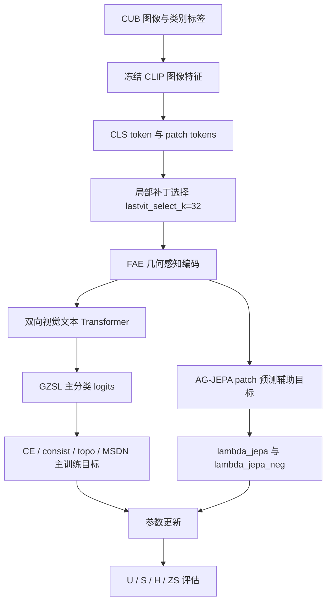

# ABL-002：去掉 AG-JEPA 辅助训练框架图记录

日期：2026-06-05

分支：`experiment/batch-ablation-cub-20260605`

训练前放行 commit：`170053d Record ABL-002 review approval`

配置：`experiments/02_ablation/ABL-002_disable_ag_jepa/config.yaml`

## 1. 这张图说明什么

这张图说明当前 CUB 训练中，主分类损失、文本拓扑损失、分支蒸馏损失和 AG-JEPA 辅助损失如何共同作用于模型训练。ABL-002 改动的是 AG-JEPA 辅助训练节点。

## 2. 代码框架图

## 3. 本实验改变了哪里

| 项目 | 内容 |
|---|---|
| 改动节点 | `AG-JEPA patch 预测辅助目标` |
| 原设置 | `use_ag_jepa=True`，`lambda_jepa=0.05`，`lambda_jepa_neg=0.02` |
| 新设置 | `use_ag_jepa=False`，`lambda_jepa=0.0`，`lambda_jepa_neg=0.0` |
| 保留设置 | `lastvit_select_k=32`，保留局部补丁选择；`lr_stages=null`，严格连续训练 |
| 预期影响 | 如果 AG-JEPA 有效，关闭后 H 应下降 |

代码证据：

- `model/MyModel.py` 中只有 `self.use_ag_jepa` 为真时才创建 `jepa_predictor`。
- loss 分支要求 `self.use_ag_jepa` 且 `lambda_jepa` 或 `lambda_jepa_neg` 大于 0 才计算 JEPA loss。
- 本实验日志中 `JEPA: 0.0000`、`JNeg: 0.0000`，说明辅助损失已关闭。

## 4. 数据

| seed | U | S | H | ZS | 最佳轮次 | 原始日志 | 实验日志副本 |
|---:|---:|---:|---:|---:|---:|---|---|
| 5 | 76.00 | 66.76 | 71.08 | 81.66 | 11 | `train_log/CUB/training_log_CUB_2026-06-05_23-39-36.txt` | `experiments/02_ablation/ABL-002_disable_ag_jepa/logs/ABL-002_CUB_seed5_20260605-233936.txt` |

## 5. 结论

ABL-002 的主指标 H=71.08，低于当前主基线 H=72.91，下降 1.83。观察事实支持“AG-JEPA 辅助训练是当前框架的有效训练信号”：关闭后，模型仍能训练，但 GZSL-H 明显下降。

对代码框架理解的影响：AG-JEPA 不只是额外正则项，它为局部视觉 token 与类别文本之间提供了有效的语义预测约束。后续更值得做的是 `lambda_jepa`、`lambda_jepa_neg` 和 margin 的权重扫描，而不是直接移除该节点。
