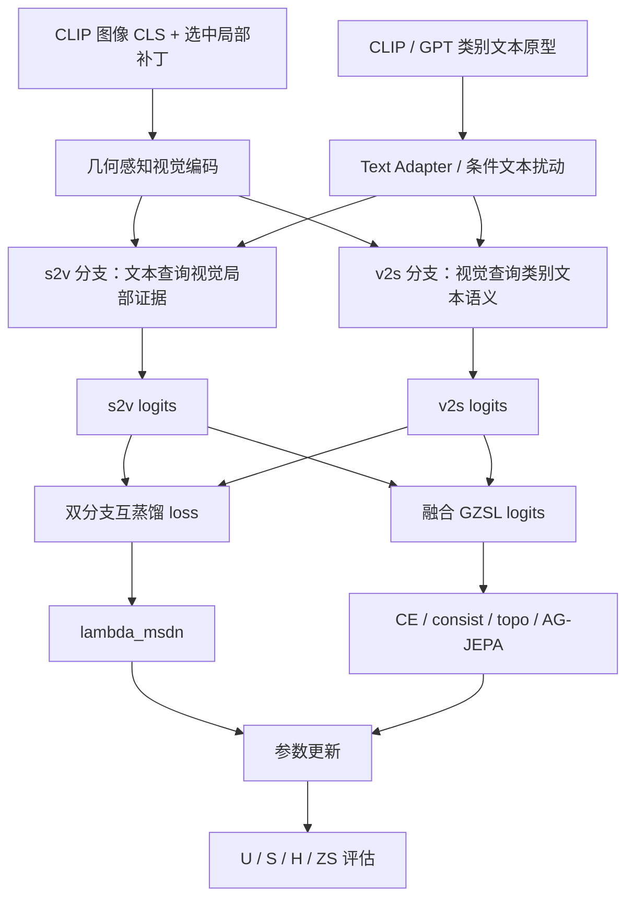

# ABL-004：去掉双分支互蒸馏框架图记录

日期：2026-06-06

分支：`experiment/batch-ablation-cub-20260605`

训练前放行 commit：`61723f3 Record ABL-004 review approval`

配置：`experiments/02_ablation/ABL-004_disable_branch_distillation/config.yaml`

## 1. 这张图说明什么

这张图说明当前训练中，s2v 与 v2s 两条视觉-文本交互分支如何分别产生 logits，并通过互蒸馏 loss 约束两条分支互相校正。ABL-004 改动的是双分支互蒸馏 loss 节点。

## 2. 代码框架图

## 3. 本实验改变了哪里

| 项目 | 内容 |
|---|---|
| 改动节点 | `双分支互蒸馏 loss` |
| 原设置 | `lambda_msdn=0.05` |
| 新设置 | `lambda_msdn=0.0` |
| 保留设置 | `lastvit_select_k=32`，`use_ag_jepa=True`，`lambda_topo_pearson=0.05`，严格连续训练 |
| 预期影响 | 如果双分支互蒸馏有效，关闭后 H 应下降 |

代码证据：

- `model/MyModel.py` 中 `lambda_msdn > 0` 且两条分支 logits 存在时才计算互蒸馏 loss。
- 本实验配置设置 `lambda_msdn.value = 0.0`。
- 本实验日志中 `MSDN: 0.0000`，说明双分支互蒸馏 loss 已关闭。

## 4. 数据

| seed | U | S | H | ZS | 最佳轮次 | 原始日志 | 实验日志副本 |
|---:|---:|---:|---:|---:|---:|---|---|
| 5 | 73.30 | 68.83 | 71.00 | 81.52 | 9 | `train_log/CUB/training_log_CUB_2026-06-06_00-11-33.txt` | `experiments/02_ablation/ABL-004_disable_branch_distillation/logs/ABL-004_CUB_seed5_20260606-001133.txt` |

## 5. 结论

ABL-004 的主指标 H=71.00，低于当前主基线 H=72.91，下降 1.91。观察事实支持“双分支互蒸馏是当前框架的有效约束”：关闭后模型仍能训练，但 seen/unseen 平衡下降。

对代码框架理解的影响：s2v 和 v2s 两条分支不是完全冗余的并行路径，互蒸馏提供了分支间校正信号。后续更值得做的是 `lambda_msdn` 权重扫描，而不是直接移除该节点。
