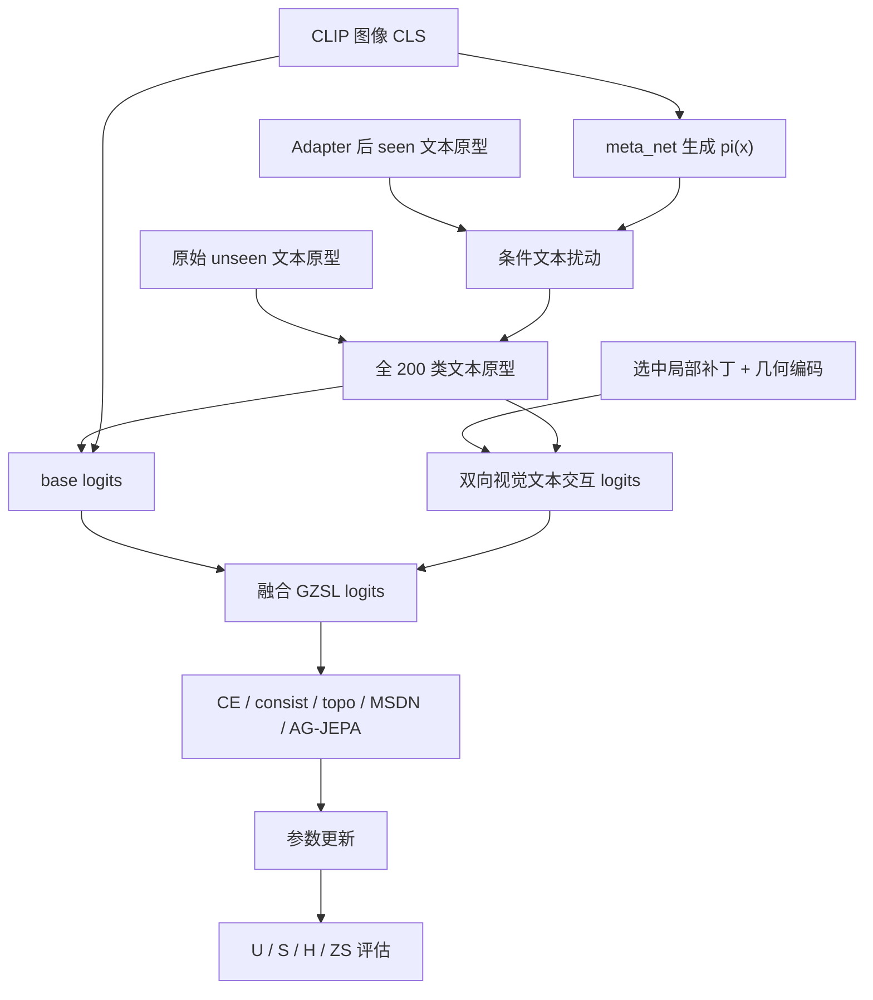

# ABL-005：去掉条件文本扰动框架图记录

日期：2026-06-06

分支：`experiment/batch-ablation-cub-20260605`

训练前放行 commit：`32a9c79 Record ABL-005 review approval`

配置：`experiments/02_ablation/ABL-005_disable_conditional_text/config.yaml`

## 1. 这张图说明什么

这张图说明当前训练中，图像 CLS 如何通过 meta net 生成每张图自己的文本扰动向量，并只作用于 seen 类文本原型，从而影响 base logits。ABL-005 改动的是条件文本扰动节点。

## 2. 代码框架图

## 3. 本实验改变了哪里

| 项目 | 内容 |
|---|---|
| 改动节点 | `条件文本扰动` |
| 原设置 | `use_conditional_text=True`，`conditional_text_ratio=0.005` |
| 新设置 | `use_conditional_text=False`，`conditional_text_ratio=0.0` |
| 保留设置 | `lastvit_select_k=32`，`lambda_msdn=0.05`，`lambda_topo_pearson=0.05`，`use_ag_jepa=True`，严格连续训练 |
| 预期影响 | 如果条件文本扰动有效，关闭后 H 应下降 |

代码证据：

- `model/MyModel.py` 中只有 `use_conditional_text` 为真、`cls_token` 存在且 `cond_text_ratio > 0` 时，才会进入 per-image 条件文本扰动路径。
- 本实验配置设置 `use_conditional_text.value = False` 和 `conditional_text_ratio.value = 0.0`。
- 因此本实验会跳过条件文本扰动，使用静态全类别文本原型计算 base logits。

## 4. 数据

| seed | U | S | H | ZS | 最佳轮次 | 原始日志 | 实验日志副本 |
|---:|---:|---:|---:|---:|---:|---|---|
| 5 | 72.97 | 71.29 | 72.12 | 81.86 | 10 | `train_log/CUB/training_log_CUB_2026-06-06_00-25-24.txt` | `experiments/02_ablation/ABL-005_disable_conditional_text/logs/ABL-005_CUB_seed5_20260606-002524.txt` |

## 5. 结论

ABL-005 的主指标 H=72.12，低于当前主基线 H=72.91，下降 0.79。观察事实支持“条件文本扰动有正贡献”，但贡献幅度小于文本拓扑保持、AG-JEPA 和双分支互蒸馏。

对代码框架理解的影响：条件文本扰动不是决定性主模块，但能轻量改善 seen/unseen 平衡。当前更合理的做法是保留小幅度扰动，并在后续调参中谨慎扫描 `conditional_text_ratio`，避免扰动过大导致 unseen 文本空间漂移。
