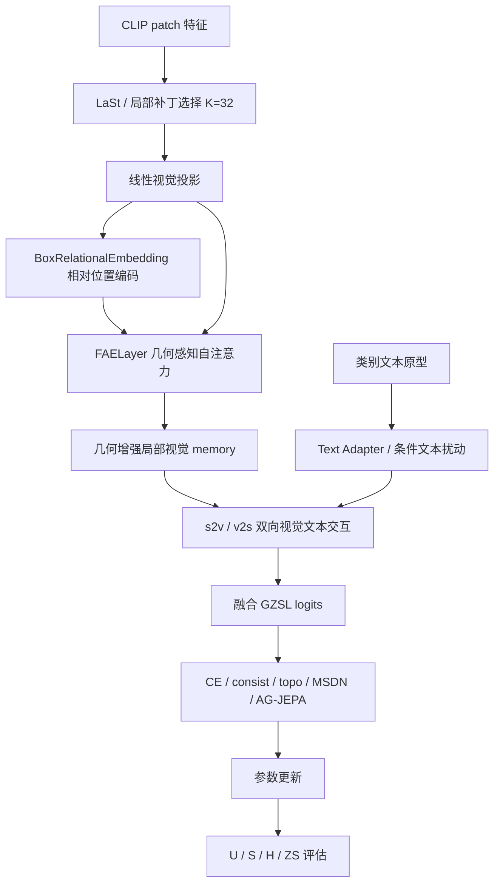

# ABL-006：去掉几何感知编码框架图记录

日期：2026-06-06

分支：`experiment/batch-ablation-cub-20260605`

训练前放行 commit：`7c26d7f Record ABL-006 review approval`

配置：`experiments/02_ablation/ABL-006_disable_geometry_encoding/config.yaml`

## 1. 这张图说明什么

这张图说明当前训练中，选中的局部 patch 如何先经过 FAE 几何感知视觉编码，再进入双向视觉-文本交互。ABL-006 改动的是几何感知视觉编码节点。

## 2. 代码框架图

## 3. 本实验改变了哪里

| 项目 | 内容 |
|---|---|
| 改动节点 | `FAELayer 几何感知视觉编码` |
| 原设置 | `use_fae=True` |
| 新设置 | `use_fae=False` |
| 保留设置 | `lastvit_select_k=32`，`use_conditional_text=True`，`lambda_msdn=0.05`，`lambda_topo_pearson=0.05`，`use_ag_jepa=True`，严格连续训练 |
| 预期影响 | 如果几何感知编码有效，关闭后 H 应下降 |

代码证据：

- `model/MyModel.py` 中 `use_fae=True` 时才创建 `BoxRelationalEmbedding` 和 `FAELayer`。
- `use_fae=False` 时，视觉 memory 直接等于线性投影后的 patch 表示 `vis`。
- 本实验配置设置 `use_fae.value = False`。

## 4. 数据

| seed | U | S | H | ZS | 最佳轮次 | 原始日志 | 实验日志副本 |
|---:|---:|---:|---:|---:|---:|---|---|
| 5 | 73.60 | 68.49 | 70.95 | 81.51 | 11 | `train_log/CUB/training_log_CUB_2026-06-06_00-37-02.txt` | `experiments/02_ablation/ABL-006_disable_geometry_encoding/logs/ABL-006_CUB_seed5_20260606-003702.txt` |

## 5. 结论

ABL-006 的主指标 H=70.95，低于当前主基线 H=72.91，下降 1.96。观察事实支持“几何感知视觉编码是当前框架的重要局部视觉模块”：即使已经选出 32 个局部补丁，补丁之间的位置关系建模仍然提供有效约束。

对代码框架理解的影响：局部补丁选择负责减少噪声和建立信息瓶颈，FAE 几何编码负责在瓶颈内部建模空间关系。二者不是互相替代的模块，而是连续的局部视觉处理链条。
