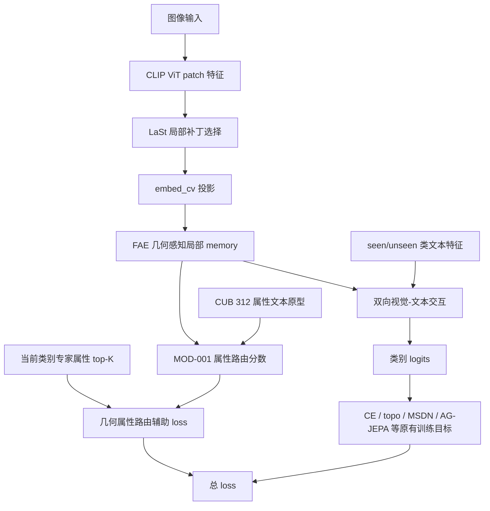

# MOD-001 几何感知属性路由框架图

日期: 2026-06-07

状态: 已完成 / 当前版本不保留

## 1. 这张图说明什么

这张图记录 MOD-001 相对当前 DVSR 主框架新增的训练期辅助路径。主分类路径仍然是 CLIP patch 经过局部补丁选择、FAE 几何编码、双向视觉-文本交互后输出类别 logits；MOD-001 只在 FAE 后额外加入属性路由分数和辅助 loss，用来验证局部视觉 memory 是否能更明确地对齐 CUB 属性原型。

## 2. 本实验改了哪个节点或边

- 新增节点: `MOD-001 属性路由分数`。
- 新增输入: `CUB 312 属性文本原型` 和 `当前类别专家属性 top-K`。
- 新增训练边: `FAE 几何感知局部 memory -> 属性路由分数 -> 几何属性路由辅助 loss -> 总 loss`。
- 未改动主推理边: `FAE 几何感知局部 memory -> 双向视觉-文本交互 -> 类别 logits`。
- 关闭开关时: `use_geo_attr_routing=False` 且 `lambda_geo_attr_routing=0.0`，不计算属性路由辅助项，主框架退回 baseline 路径。

## 3. 关键配置

| 配置项 | 主配置默认 | MOD-001 实验值 |
|---|---:|---:|
| `use_geo_attr_routing` | `False` | `True` |
| `lambda_geo_attr_routing` | `0.0` | `0.05` |
| `geo_attr_route_topk` | `16` | `16` |
| `geo_attr_route_temp` | `14.28` | `14.28` |

## 4. 结果数据

| seed | U | S | H | ZS | 最佳轮次 |
|---:|---:|---:|---:|---:|---:|
| 5 | 73.24 | 71.68 | 72.45 | 81.49 | 51 |

对比固定 seed=5 baseline:

| 对比对象 | H | 差值 |
|---|---:|---:|
| 当前主框架 baseline | 72.91 | 0.00 |
| MOD-001 | 72.45 | -0.46 |

## 5. 日志和产物

| 类型 | 路径 |
|---|---|
| 原始训练日志 | `train_log/CUB/training_log_CUB_2026-06-07_18-23-26.txt` |
| 实验日志副本 | `experiments/01_module_replacement/MOD-001_geometry_attribute_routing/logs/MOD-001_seed5_2026-06-07_18-23-26_training_log.txt` |
| 最佳模型 | `train_log/CUB/best_model_CUB_2026-06-07_18-23-26_H7245.pth` |
| 完整 checkpoint | `train_log/CUB/ckpt_full_CUB_2026-06-07_18-23-26.pth` |
| Claude 审查 | `experiments/01_module_replacement/MOD-001_geometry_attribute_routing/claude-review.md` |

## 6. 对框架理解的影响

MOD-001 说明“把 FAE memory 直接压到类别 top-K 属性原型”这一版没有提升 H，反而让 seed=5 的 H 从 72.91 降到 72.45。当前证据更支持保留 FAE 几何编码和主双向交互路径，同时把后续局部属性方向转向更精细的 patch-token / attribute-token 对齐，例如 MOD-004 的属性引导局部补丁 OT，而不是继续加大这一版属性路由 loss。
