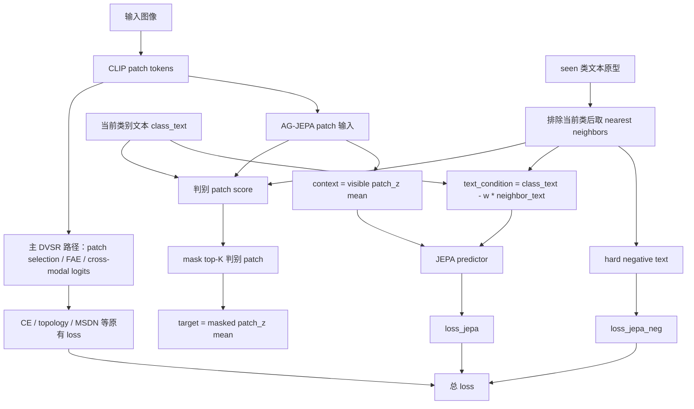

# MOD-005 语义补丁 JEPA v2 框架图

日期: 2026-06-07

状态: 已完成

## 1. 实验目标

验证把现有 AG-JEPA 从“类别文本直接选择 top-K patch”改成“类别文本相对近邻类别原型的判别 patch 选择”，是否能提升 CUB GZSL 主指标 H。

## 2. 代码框架图

## 3. 本次改动点

| 位置 | 改动 |
|---|---|
| `model/MyModel.py` | `_ag_jepa_loss` 增加 v2 分支；开启时用 seen nearest neighbor 调整 patch score、text condition 和 negative text |
| `train_VGSR_CUB.py` | 日志打印 `use_ag_jepa_v2` |
| `config/VGSR_cub_gzsl.yaml` | 新增默认关闭的 AG-JEPA v2 配置 |
| `experiments/01_module_replacement/MOD-005_semantic_patch_jepa_v2/config.yaml` | 实验配置中打开 AG-JEPA v2 |

## 4. 配置

| 配置项 | 主配置默认 | 实验值 |
|---|---:|---:|
| `use_ag_jepa_v2` | `False` | `True` |
| `jepa_v2_neighbor_topk` | `5` | `5` |
| `jepa_v2_neighbor_weight` | `0.2` | `0.2` |
| `lambda_jepa` | `0.05` | `0.05` |
| `lambda_jepa_neg` | `0.02` | `0.02` |
| `jepa_topk` | `8` | `8` |

## 5. 结果数据

| 数据集 | seed | U | S | H | ZS | 最佳 epoch | baseline H | ΔH |
|---|---:|---:|---:|---:|---:|---:|---:|---:|
| CUB GZSL | 5 | 73.10 | 72.03 | 72.56 | 81.55 | 23 | 72.91 | -0.35 |

日志与产物:

- 原始日志: `train_log/CUB/training_log_CUB_2026-06-07_20-30-43.txt`
- 实验日志副本: `experiments/01_module_replacement/MOD-005_semantic_patch_jepa_v2/logs/MOD-005_CUB_seed5_20260607-203043.txt`
- 最佳模型: `train_log/CUB/best_model_CUB_2026-06-07_20-30-43_H7256.pth`
- 完整 checkpoint: `train_log/CUB/ckpt_full_CUB_2026-06-07_20-30-43.pth`

## 6. 结论

MOD-005 没有提升 H，当前 v2 不保留。结果说明 AG-JEPA 本身重要，但把目标改成强 hard-neighbor 判别式后收益下降。后续若继续做自监督辅助目标，应保留原 AG-JEPA 的稳定正目标，只在 hard negative 或目标混合比例上做更温和的局部修改。
