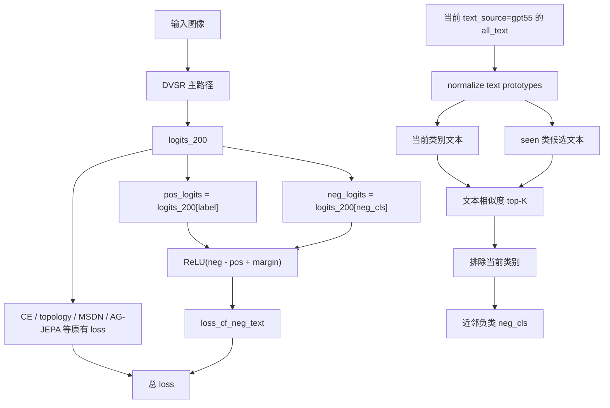

# MOD-006 反事实负文本挖掘框架图

日期: 2026-06-07

状态: 已完成

## 1. 实验目标

验证从 GPT 类别文本原型中挖掘相似 seen 类作为反事实负文本，并对当前类 logit 加轻量 margin 约束，是否能提升 CUB GZSL 主指标 H。

## 2. 代码框架图

## 3. 本次改动点

| 位置 | 改动 |
|---|---|
| `model/MyModel.py` | `compute_loss` 增加 `loss_cf_neg_text`，只在开关打开且权重大于 0 时计算 |
| `train_VGSR_CUB.py` | 日志打印 `use_cf_neg_text`、`lambda_cf_neg_text` 和 `CFNeg` |
| `config/VGSR_cub_gzsl.yaml` | 新增默认关闭的反事实负文本配置 |
| `experiments/01_module_replacement/MOD-006_counterfactual_negative_text_mining/config.yaml` | 实验配置中打开反事实负文本 margin |

## 4. 配置

| 配置项 | 主配置默认 | 实验值 |
|---|---:|---:|
| `use_cf_neg_text` | `False` | `True` |
| `lambda_cf_neg_text` | `0.0` | `0.03` |
| `cf_neg_topk` | `5` | `5` |
| `cf_neg_margin` | `0.2` | `0.2` |

## 5. 结果数据

| 数据集 | seed | U | S | H | ZS | 最佳 epoch | baseline H | ΔH |
|---|---:|---:|---:|---:|---:|---:|---:|---:|
| CUB GZSL | 5 | 72.65 | 72.13 | 72.39 | 81.44 | 51 | 72.91 | -0.52 |

日志与产物:

- 原始日志: `train_log/CUB/training_log_CUB_2026-06-07_20-50-24.txt`
- 实验日志副本: `experiments/01_module_replacement/MOD-006_counterfactual_negative_text_mining/logs/MOD-006_CUB_seed5_20260607-205024.txt`
- 最佳模型: `train_log/CUB/best_model_CUB_2026-06-07_20-50-24_H7239.pth`
- 完整 checkpoint: `train_log/CUB/ckpt_full_CUB_2026-06-07_20-50-24.pth`

## 6. 结论

MOD-006 没有提升 H，当前训练期反事实负文本 margin 不保留。结果说明直接压 seen 近邻负类边界会削弱 GZSL 泛化；如果继续做负文本方向，应转向推理期重排、离线描述筛选，或只对高置信混淆类使用更小权重。
