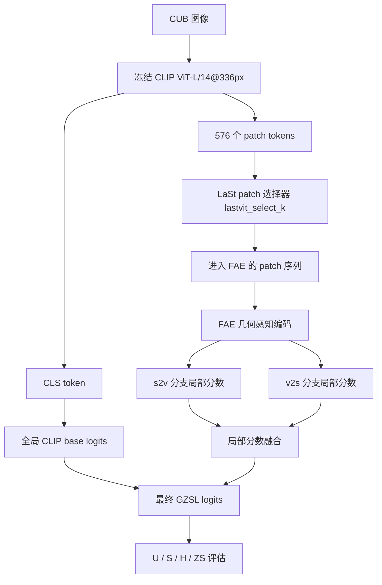

# ABL-001：去掉局部补丁选择框架图记录

日期：2026-06-05

分支：`experiment/ABL-001-disable-patch-selection`

训练前放行 commit：`dda3a51 Record ABL-001 review approval`

配置：`experiments/05_ablation/ABL-001_disable_patch_selection/config.yaml`

## 1. 这张图说明什么

这张图说明 CUB 训练和评估中，CLIP 图像特征、patch token、局部补丁选择、FAE 几何感知编码、双向视觉文本交互和最终 GZSL 分类分数之间的数据流。ABL-001 改动的是 patch token 进入 FAE 之前的局部补丁选择节点。

## 2. 代码框架图

## 3. 本实验改变了哪里

| 项目 | 内容 |
|---|---|
| 改动节点 | `LaSt patch 选择器 lastvit_select_k` |
| 原设置 | `lastvit_select_k=32`，选择 32 个局部补丁进入后续局部建模 |
| 新设置 | `lastvit_select_k=0`，关闭选择器，576 个 patch 全部进入 FAE |
| 预期影响 | 如果局部补丁选择是有效信息瓶颈，关闭后 H 应下降 |

代码证据：

- `model/MyModel.py` 中只有 `lastvit_select_k > 0 and lastvit_select_k < patches.size(1)` 时才执行 patch gather。
- 本实验配置设置 `lastvit_select_k.value = 0`，因此不进入选择器分支。
- `lr_stages.value = null`，训练脚本中会解析为空列表并走严格连续训练流程。

## 4. 数据

| seed | U | S | H | ZS | 最佳轮次 | 原始日志 | 实验日志副本 |
|---:|---:|---:|---:|---:|---:|---|---|
| 5 | 74.22 | 69.07 | 71.55 | 81.84 | 9 | `train_log/CUB/training_log_CUB_2026-06-05_22-43-55.txt` | `experiments/05_ablation/ABL-001_disable_patch_selection/logs/ABL-001_CUB_seed5_20260605-224355_attempt2.txt` |

失败启动记录：

| attempt | 状态 | 原因 | 日志副本 |
|---:|---|---|---|
| 1 | failed | Windows GBK 控制台无法编码日志中的 `⚠` 字符，训练未进入 epoch | `experiments/05_ablation/ABL-001_disable_patch_selection/logs/ABL-001_CUB_seed5_20260605-224002_attempt1_failed_encoding.txt` |

## 5. 结论

ABL-001 的主指标 H=71.55，低于当前主基线 H=72.91，下降 1.36。观察事实支持“局部补丁选择是当前框架的有效组成部分”：关闭选择器后，模型虽然仍能利用全量 patch 和 FAE 完成训练，但 GZSL-H 明显低于保留 32 个局部补丁选择的主框架。

对代码框架理解的影响：`lastvit_select_k` 不只是加速或减少 token 的工程开关，它在当前设置下更像一个有效的信息瓶颈，帮助后续 FAE 和双向视觉文本交互聚焦更有判别力的局部 token。后续更值得做的是补丁数量扫描或选择策略替换，而不是直接移除该节点。
