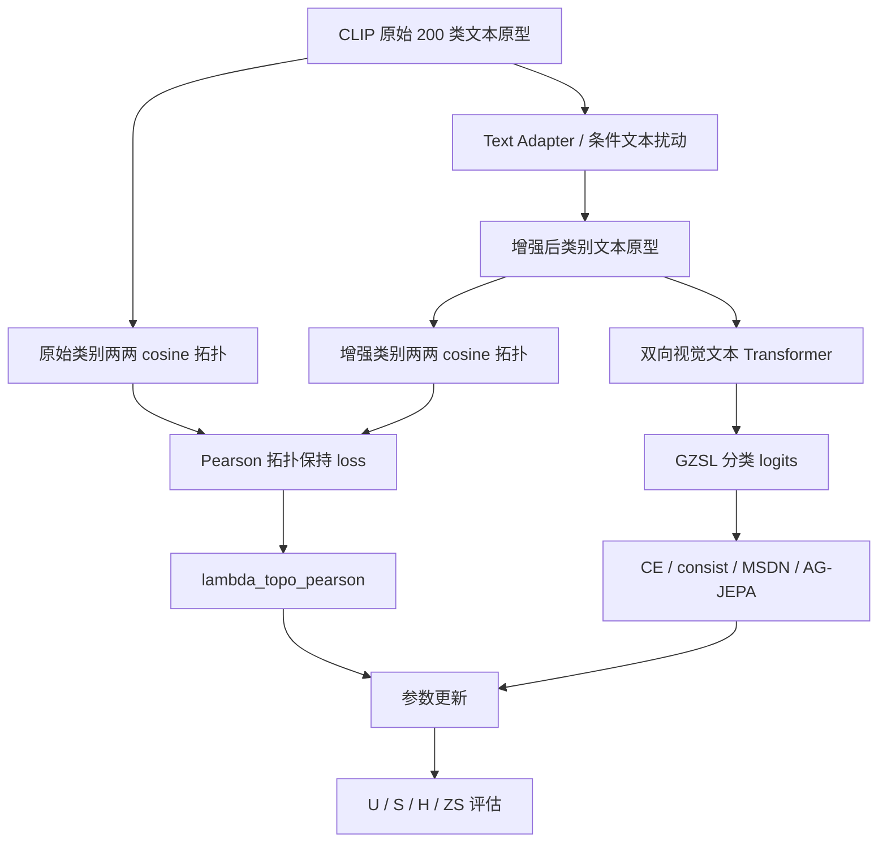

# ABL-003：去掉文本拓扑保持框架图记录

日期：2026-06-05

分支：`experiment/batch-ablation-cub-20260605`

训练前放行 commit：`93cbd1e Record ABL-003 review approval`

配置：`experiments/05_ablation/ABL-003_disable_text_topology/config.yaml`

## 1. 这张图说明什么

这张图说明当前训练中，文本原型经过 Adapter 和图像条件化扰动后，如何通过拓扑保持 loss 约束增强文本空间不要偏离 CLIP 原始类别关系。ABL-003 改动的是文本拓扑保持 loss 节点。

## 2. 代码框架图

## 3. 本实验改变了哪里

| 项目 | 内容 |
|---|---|
| 改动节点 | `Pearson 拓扑保持 loss` |
| 原设置 | `lambda_topo_pearson=0.05` |
| 新设置 | `lambda_topo_pearson=0.0` |
| 保留设置 | `lastvit_select_k=32`，`use_ag_jepa=True`，严格连续训练 |
| 预期影响 | 如果拓扑保持有效，关闭后 H 应下降 |

代码证据：

- `model/MyModel.py` 中 `lambda_topo_pearson > 0` 时才计算 `_topology_pearson_loss`。
- 本实验配置设置 `lambda_topo_pearson.value = 0.0`。
- 本实验日志中 `Topo: 0.0000`，说明文本拓扑 loss 已关闭。

## 4. 数据

| seed | U | S | H | ZS | 最佳轮次 | 原始日志 | 实验日志副本 |
|---:|---:|---:|---:|---:|---:|---|---|
| 5 | 74.54 | 65.97 | 70.00 | 81.64 | 9 | `train_log/CUB/training_log_CUB_2026-06-05_23-51-48.txt` | `experiments/05_ablation/ABL-003_disable_text_topology/logs/ABL-003_CUB_seed5_20260605-235148.txt` |

## 5. 结论

ABL-003 的主指标 H=70.00，低于当前主基线 H=72.91，下降 2.91。观察事实支持“文本拓扑保持是当前框架的关键约束”：关闭后，模型仍能训练，但 seen/unseen 平衡明显恶化。

对代码框架理解的影响：在 frozen CLIP + seen-only 训练场景下，文本原型很容易被 seen 类监督拉散，拓扑保持 loss 提供了保护 unseen 类语义结构的约束。后续更值得做的是 `lambda_topo_pearson` 权重扫描，而不是直接移除该节点。
