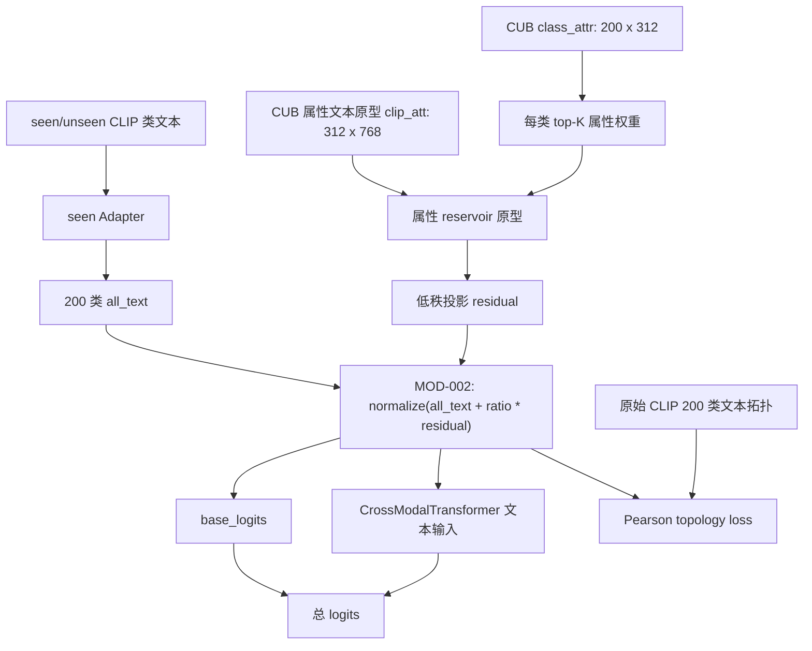

# MOD-002 拓扑感知文本属性库框架图

日期: 2026-06-07

状态: 已完成 / 当前版本不保留

## 1. 这张图说明什么

这张图记录 MOD-002 相对当前 DVSR 主框架新增的文本侧 reservoir 路径。它不改视觉主干、patch 选择、FAE、MSDN 或 AG-JEPA，而是在 200 类文本原型进入 base logits 和 cross_tf 之前，用 CUB 属性文本原型生成一个低秩残差，并继续用现有 Pearson topology loss 约束增强后的文本拓扑。

## 2. 本实验改了哪个节点或边

- 新增节点: `属性 reservoir 原型`、`低秩投影 residual`、`MOD-002 文本残差融合`。
- 新增边: `CUB class_attr / clip_att -> text reservoir -> all_text`。
- 复用约束: 现有 `lambda_topo_pearson=0.05` 约束增强后 `all_text`。
- 未改动: patch 选择、FAE、双向交互结构、AG-JEPA、MSDN、评估口径。
- 关闭开关时: `use_text_attr_reservoir=False` 且 `text_attr_reservoir_ratio=0.0`，不调用 reservoir 路径，退回 baseline。

## 3. 关键配置

| 配置项 | 主配置默认 | MOD-002 实验值 |
|---|---:|---:|
| `use_text_attr_reservoir` | `False` | `True` |
| `text_attr_reservoir_ratio` | `0.0` | `0.05` |
| `text_attr_reservoir_topk` | `32` | `32` |
| `text_attr_reservoir_temp` | `10.0` | `10.0` |
| `text_attr_reservoir_hidden` | `256` | `256` |
| `lambda_topo_pearson` | `0.05` | `0.05` |

## 4. 结果数据

| seed | U | S | H | ZS | 最佳轮次 |
|---:|---:|---:|---:|---:|---:|
| 5 | 75.39 | 64.02 | 69.24 | 80.78 | 22 |

对比固定 seed=5 baseline:

| 对比对象 | H | 差值 |
|---|---:|---:|
| 当前主框架 baseline | 72.91 | 0.00 |
| MOD-002 | 69.24 | -3.67 |

## 5. 日志和产物

| 类型 | 路径 |
|---|---|
| 原始训练日志 | `train_log/CUB/training_log_CUB_2026-06-07_19-10-33.txt` |
| 实验日志副本 | `experiments/01_single_module_innovation/MOD-002_topology_aware_text_reservoir/logs/MOD-002_CUB_seed5_20260607-191033.txt` |
| 最佳模型 | `train_log/CUB/best_model_CUB_2026-06-07_19-10-33_H6924.pth` |
| 完整 checkpoint | `train_log/CUB/ckpt_full_CUB_2026-06-07_19-10-33.pth` |
| Claude 审查 | `experiments/01_single_module_innovation/MOD-002_topology_aware_text_reservoir/claude-review.md` |

## 6. 对框架理解的影响

MOD-002 说明直接把属性 reservoir 残差加到 200 类文本原型上，会明显拉低 seen 准确率：U=75.39 高于 baseline U=73.30，但 S=64.02 远低于 baseline S=72.53，最终 H=69.24。当前框架对文本拓扑扰动非常敏感；TPR 方向如果继续，应把 reservoir 改得更局部、更受控，例如只在 seen Adapter 内部加门控残差，或让 residual gate 从 0 开始学习，并增加对 seen 判别的约束。
