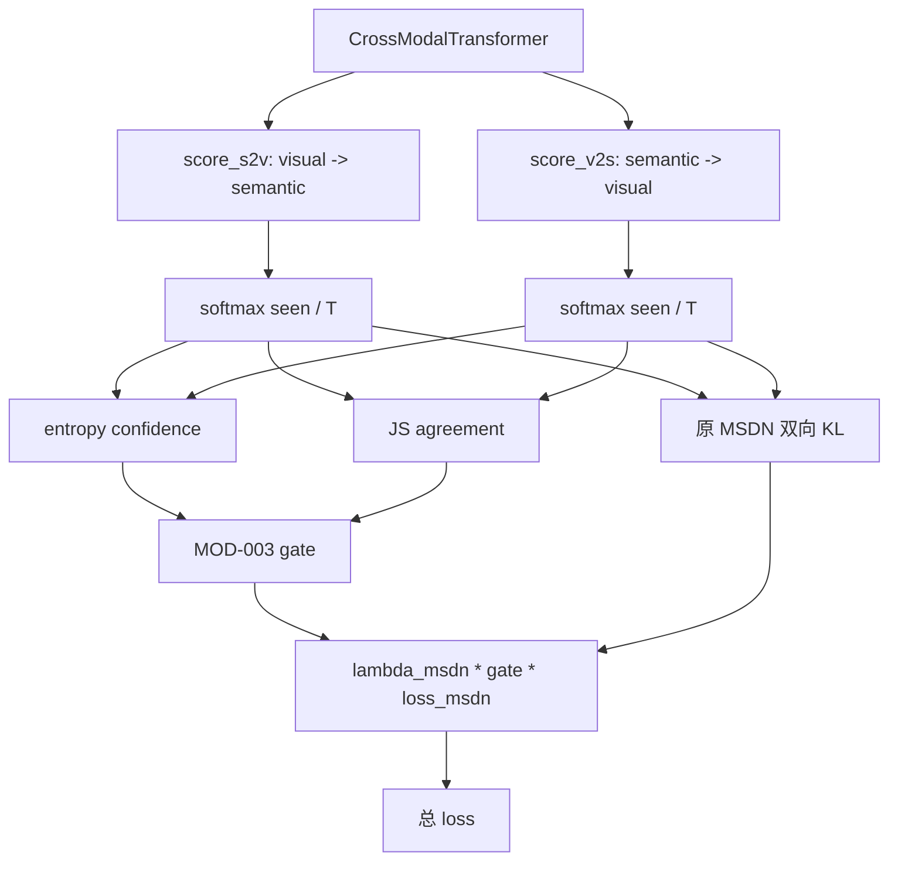

# MOD-003 不确定性门控分支蒸馏框架图

日期: 2026-06-07

状态: 已完成 / 当前版本不保留

## 1. 这张图说明什么

这张图记录 MOD-003 对当前 MSDN 双分支互蒸馏 loss 的外层门控改造。主 forward、logits、patch 选择、FAE、AG-JEPA 都不变；只在 `compute_loss` 中根据两个分支的 seen 类预测熵和 JS 分歧，缩放原本的 `lambda_msdn * loss_msdn`。

## 2. 本实验改了哪个节点或边

- 新增节点: `entropy confidence`、`JS agreement`、`MOD-003 gate`。
- 新增边: `score_s2v/score_v2s -> gate -> MSDN loss 权重`。
- 未改动: score 生成、主 logits、CE、topology loss、AG-JEPA。
- 关闭开关时: `use_uncertainty_msdn_gate=False`，`loss_msdn_gate=1.0`，退回原固定 MSDN。

## 3. 关键配置

| 配置项 | 主配置默认 | MOD-003 实验值 |
|---|---:|---:|
| `use_uncertainty_msdn_gate` | `False` | `True` |
| `msdn_gate_min` | `0.2` | `0.2` |
| `msdn_gate_js_alpha` | `4.0` | `4.0` |
| `lambda_msdn` | `0.05` | `0.05` |

## 4. 结果数据

| seed | U | S | H | ZS | 最佳轮次 |
|---:|---:|---:|---:|---:|---:|
| 5 | 72.83 | 72.39 | 72.61 | 81.15 | 51 |

对比固定 seed=5 baseline:

| 对比对象 | H | 差值 |
|---|---:|---:|
| 当前主框架 baseline | 72.91 | 0.00 |
| MOD-003 | 72.61 | -0.30 |

## 5. 日志和产物

| 类型 | 路径 |
|---|---|
| 原始训练日志 | `train_log/CUB/training_log_CUB_2026-06-07_19-37-58.txt` |
| 实验日志副本 | `experiments/01_single_module_innovation/MOD-003_uncertainty_gated_branch_distillation/logs/MOD-003_CUB_seed5_20260607-193758.txt` |
| 最佳模型 | `train_log/CUB/best_model_CUB_2026-06-07_19-37-58_H7261.pth` |
| 完整 checkpoint | `train_log/CUB/ckpt_full_CUB_2026-06-07_19-37-58.pth` |
| Claude 审查 | `experiments/01_single_module_innovation/MOD-003_uncertainty_gated_branch_distillation/claude-review.md` |

## 6. 对框架理解的影响

MOD-003 说明当前固定 MSDN 互蒸馏不应该被过度削弱。门控长期贴近 `0.20~0.21`，导致互蒸馏有效权重约为原来的五分之一，H 从 72.91 降到 72.61。后续如果继续这个方向，应把门控设计成“只在明显冲突时降权”，而不是普遍压低 MSDN。
