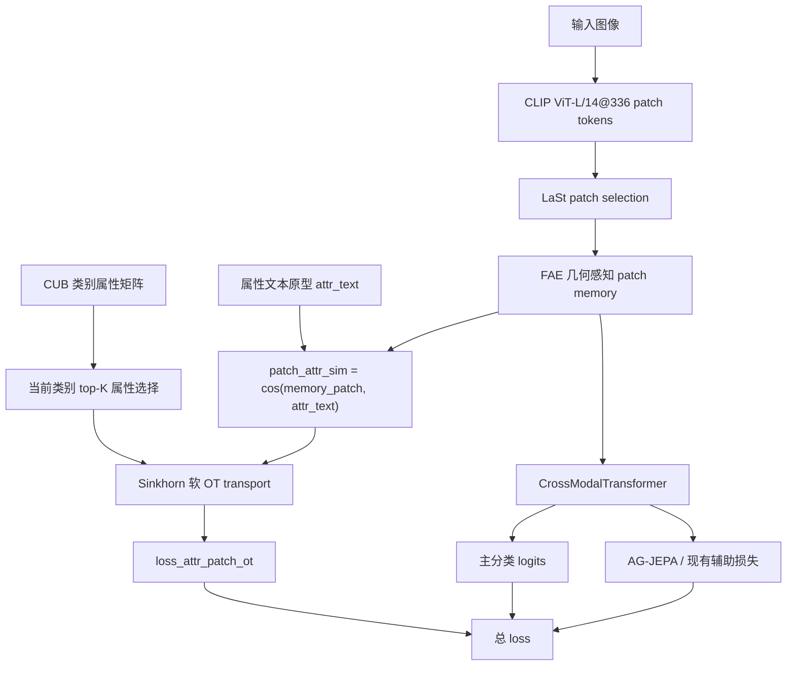

# MOD-004 属性引导的局部补丁 OT 对齐框架图

日期: 2026-06-07

状态: 已完成

## 1. 实验目标

验证在 FAE 后的局部 patch memory 与当前类别 top-K 属性文本原型之间加入 Sinkhorn 软 OT 辅助 loss，是否能提升 CUB GZSL 主指标 H。

## 2. 代码框架图

## 3. 本次改动点

| 位置 | 改动 |
|---|---|
| `model/MyModel.py` | `CrossModalTransformer.forward` 增加 `attr_text` 和 `return_attr_patch_sim`；开启时返回 `[B, N_patch, 312]` 的 `attr_patch_sim` |
| `train_VGSR_CUB.py` | `VGSR.compute_loss` 增加 `loss_attr_patch_ot`，只在开关打开时计算 |
| `config/VGSR_cub_gzsl.yaml` | 新增默认关闭的属性 OT 配置 |
| `experiments/01_single_module_innovation/MOD-004_attribute_guided_patch_ot/config.yaml` | 实验配置中打开属性 OT |

## 4. 配置

| 配置项 | 主配置默认 | 实验值 |
|---|---:|---:|
| `use_attr_patch_ot` | `False` | `True` |
| `lambda_attr_patch_ot` | `0.0` | `0.02` |
| `attr_patch_ot_topk` | `16` | `16` |
| `attr_patch_ot_temp` | `10.0` | `10.0` |
| `attr_patch_ot_iter` | `3` | `3` |

## 5. 结果数据

| 数据集 | seed | U | S | H | ZS | 最佳 epoch | baseline H | ΔH |
|---|---:|---:|---:|---:|---:|---:|---:|---:|
| CUB GZSL | 5 | 72.86 | 72.95 | 72.90 | 81.61 | 30 | 72.91 | -0.01 |

日志与产物:

- 原始日志: `train_log/CUB/training_log_CUB_2026-06-07_19-56-46.txt`
- 实验日志副本: `experiments/01_single_module_innovation/MOD-004_attribute_guided_patch_ot/logs/MOD-004_CUB_seed5_20260607-195646.txt`
- 最佳模型: `train_log/CUB/best_model_CUB_2026-06-07_19-56-46_H7290.pth`
- 完整 checkpoint: `train_log/CUB/ckpt_full_CUB_2026-06-07_19-56-46.pth`

## 6. 结论

MOD-004 几乎持平 baseline，但没有达成提升。当前训练期 OT 辅助 loss 不保留为主框架默认模块；因为 S 有提升且 H 只低 0.01，这个方向保留为中性候选，后续更适合尝试小权重、推理期局部分数或更稳定的属性 token 选择。
