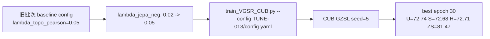

# TUNE-013 调参流程记录

## 流程

## 说明

本实验补跑原始 TUNE 批次中断项，测试更强 AG-JEPA negative loss。当前主 baseline 已是 TUNE-004，H=73.35。

## 结论

H=72.71，低于当前 baseline，不提升。

## 日志

- `experiments/04_hyperparameter_tuning/TUNE-013_jepa_neg_005/logs/TUNE-013_CUB_seed5_2026-06-09_20-57-52.txt`
