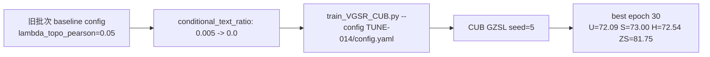

# TUNE-014 调参流程记录

## 流程

## 说明

本实验测试关闭 conditional text ratio 是否更稳。当前主 baseline 已是 TUNE-004，H=73.35。

## 结论

H=72.54，低于当前 baseline，不提升。

## 日志

- `experiments/04_hyperparameter_tuning/TUNE-014_conditional_text_0/logs/TUNE-014_CUB_seed5_2026-06-09_21-15-27.txt`
