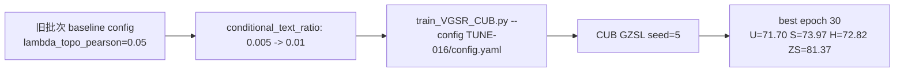

# TUNE-016 调参流程记录

## 流程

## 说明

本实验测试提高 conditional text ratio。当前主 baseline 已是 TUNE-004，H=73.35。

## 结论

H=72.82，是 TUNE-013 到 TUNE-020 中最高，但仍低于当前 baseline，不提升。

## 日志

- `experiments/04_hyperparameter_tuning/TUNE-016_conditional_text_001/logs/TUNE-016_CUB_seed5_2026-06-09_21-34-00.txt`
