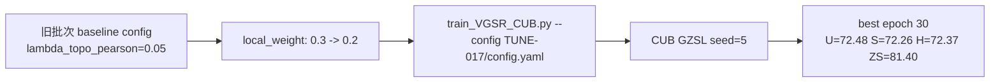

# TUNE-017 调参流程记录

## 流程

## 说明

本实验测试降低局部分数权重。当前主 baseline 已是 TUNE-004，H=73.35。

## 结论

H=72.37，低于当前 baseline，不提升。

## 日志

- `experiments/04_hyperparameter_tuning/TUNE-017_local_weight_02/logs/TUNE-017_CUB_seed5_2026-06-09_21-43-27.txt`
