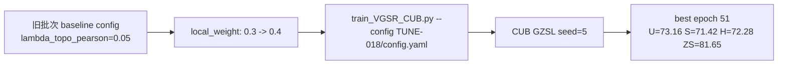

# TUNE-018 调参流程记录

## 流程

## 说明

本实验测试提高局部分数权重。当前主 baseline 已是 TUNE-004，H=73.35。

## 结论

H=72.28，低于当前 baseline，不提升。

## 日志

- `experiments/04_hyperparameter_tuning/TUNE-018_local_weight_04/logs/TUNE-018_CUB_seed5_2026-06-09_21-52-41.txt`
