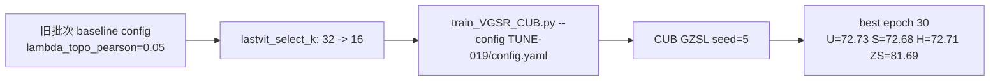

# TUNE-019 调参流程记录

## 流程

## 说明

本实验测试减少 patch 选择数量。当前主 baseline 已是 TUNE-004，H=73.35。

## 结论

H=72.71，低于当前 baseline，不提升。

## 日志

- `experiments/04_hyperparameter_tuning/TUNE-019_patch_k_16/logs/TUNE-019_CUB_seed5_2026-06-09_22-01-56.txt`
