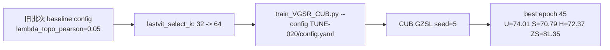

# TUNE-020 调参流程记录

## 流程

## 说明

本实验测试增加 patch 选择数量。当前主 baseline 已是 TUNE-004，H=73.35。

## 结论

U=74.01 但 S 明显下降，H=72.37，低于当前 baseline，不提升。

## 日志

- `experiments/04_hyperparameter_tuning/TUNE-020_patch_k_64/logs/TUNE-020_CUB_seed5_2026-06-09_22-11-27.txt`
