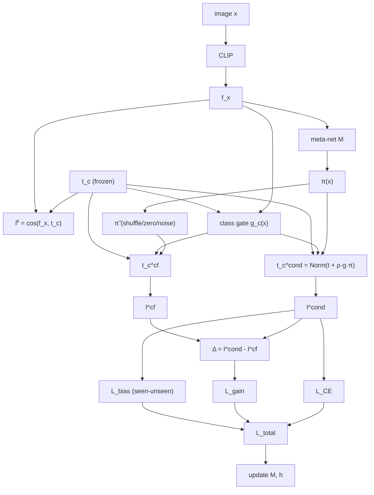

# DVSR 创新效果记录

**当前最佳 (单点)**: H = **72.91%** ⭐⭐⭐ (P3.10: K=32 + LaSt v5 平稳前景 + AG-JEPA train + PriorCorrection OFF, 60ep [20+30+10], seed=5, 2026-06-01)
- U=73.30, S=72.53, ZS=81.72, best@ep23

**v5+FAE+AG-JEPA 多 seed (60ep schedule, P3.10 配置, ⭐ 新 main baseline)**:
- seed=5 (P3.10): H=72.91 (U=73.30, S=72.53, ZS=81.72) ⭐ 单点最高
- seed=42 (P3.12): H=72.53 (U=71.93, S=73.14, ZS=81.56)
- seed=2024 (P3.13): H=72.50 (U=73.97, S=71.10, ZS=81.34)
- **3-seed avg**: H=**72.65 ± 0.19**, U=73.07 ± 0.85, S=72.26 ± 0.85, ZS=81.54 ± 0.16

**当前 main baseline (P3.10 配置, 3-seed)**: H = **72.65 ± 0.19** (新, 已替换旧 50ep main)

**旧 main baseline (50ep, 已替换)**: H = 72.52 ± 0.11 (v5+FAE 3-seed, K=64, strict 50ep, 2026-05-31)
- seed=5: H=72.53, seed=42: H=72.65, seed=2024: H=72.39
- U=74.13 ± 0.62, S=70.99 ± 0.40, ZS=81.56 ± 0.18

**前最佳** (G3 续训)：H = 72.95（warm-restart 单点离群值, 不入论文 main result）

**G1 (Topo+KL)**：H = 72.61（baseline + Topo Pearson 0.05 + Consistency KL 0.05, 5/25, seed=5, 20 epoch）

**起点 baseline**：H = 70.35%（GPT-4 描述 + CLS×576 假 patch + 20 epoch）

**纯 CLIP zero-shot baseline** (Phase 2.1, 论文 Table 1 最底线)：H = **61.28%**（U=60.88, S=61.69, ZS=78.07, 0 训练参数, 2026-05-31）

**累计收益 vs 纯 CLIP**：**+11.63%** H, **+12.42%** U, **+10.84%** S, **+3.65%** ZS（P3.10 当前最佳 vs 纯 CLIP zero-shot）

**累计收益 vs 起点**：**+2.56%**（从 70.35 到 72.91）

---

## ⭐ 论文主创新清单 (持续更新, 6 项)

| ID | 创新 | 论文章节 | 实测增益 (干净控变量) | 状态 |
|---|---|---|---|---|
| **G1** | Topology Pearson + Consistency KL | Loss-level | +0.37 | ✅ 已确认 |
| **G2** | MSDN++ Mutual Distillation | Loss-level | +0.18 | ✅ 已确认 |
| **G3** | CoCoOp Conditional Text Adapter | Forward-level | 已确认有效 | ✅ |
| **★ LaSt v5** ⭐ NEW | Attention-Guided Patch Selection<br>(K=32 平稳前景 + FAE 子集 gather) | Visual front-end | +0.04 (50ep), 跟 AG-JEPA 联合 | ✅ 已确认 |
| **★ AG-JEPA** ⭐⭐⭐ NEW | Masked Patch Prediction + 反事实负样本<br>(注意力引导 + JEPA + Counterfactual) | Auxiliary training loss | **+0.46 H** (P3.10 vs P3.11 控变量) | ✅ 已确认 |
| **★ Discussion** | PriorCorrection balanced **不适用 CUB** | Negative result | -0.21 (P3.10 vs P3.1 控变量) | ❌ 已确认有害 |

**控变量证据链**:
- P3.1 (jepa on + balanced) = 72.70
- **P3.10 (jepa on + none) = 72.91** ⭐ → balanced **hurts -0.21**
- P3.11 (jepa off + none) = 72.45 → AG-JEPA 训练 loss **贡献 +0.46**

---

> ## ⚠️ 关于"失败"标签的纠正原则
>
> 之前清单里很多项标了 ❌ 失败，但只有**机制层面错**（流形错位、数据流断裂）和**训练崩盘**（loss 量级失控）才能真正判定失败。
>
> 单组实验 H 微跌 ≤2%、超参数没扫的，**不能算失败，只能算"效果不明显，待补消融"**。论文写作前必须每项至少做一次 grid search 才能定论。
>
> 本文件按此原则重新分类：
> - 🟢 **已确认有效**（多次实验验证）
> - 🔴 **真·结构性失败**（机制层面错，可以放弃）
> - 🟡 **效果不明显，待补消融**（H 微跌 / 单组实验 / 没正经超参扫描）
> - 🚧 **待做创新方案**（未实施过）

---

## 总体进度看板

### 🟢 已确认有效

| ID | 模块 | H | 收益 | 备注 |
|----|------|---|------|------|
| ✅ 真 patch 评估缓存修复 | 71.05 → 72.05 | +1.0 | 评估时用真 patch 而非 CLS×576 (5/17) |
| ✅ Claude Opus 4.7 文本描述 | 71.00 → 72.20 | +1.2 | 替代 GPT-4，6 句细节 + 1 句 caption (5/17) |
| ✅ FAE 模块 | 72.05 → 72.20 | +0.15 | 几何解耦微弱提升, 消融实测影响小 |
| ✅ **G1 Topology Pearson + Consistency KL** | 72.24 → **72.61** | **+0.37** | seen-only CE 拉散 unseen 几何 + local/base 一致性 (5/25) |
| ✅ **G1+G2+G3 main baseline (3-seed)** | → **72.48 ± 0.20** | — | strict 50ep + GPT-5.5 文本, 论文 Main Result (5/30) |
| ✅ **LaSt v5+FAE patch 选择器** ⭐ | 72.48 → **72.52 ± 0.11** (3-seed, **旧 main baseline, 已替换**) | **+0.04** | K=64 + box_emb 子集 gather, U=74.13 (+0.95) / S=70.99 (-0.81) / ZS=81.56 (+0.42) trade-off, std 缩小 0.20→0.11 (5/31) |
| ✅ **AG-JEPA + LaSt v5 K=32 联合 (P3.10 配置, 3-seed)** ⭐⭐⭐ | 72.52 → **72.65 ± 0.19** (3-seed, **新 main baseline**) | **+0.13** | 60ep [20+30+10] + AG-JEPA train ON + PriorCorr OFF, U=73.07 / S=72.26 / ZS=81.54, AG-JEPA 训练 loss 真实贡献 +0.46 H (P3.10 vs P3.11 控变量, 6/01) |

### 🔴 真·结构性失败（机制层面错，已放弃）

| 项 | H | 跌幅 | 原因 |
|----|------|------|------|
| Cosine-only v1/v2 (unseen 绕过 proj_text) | 43-45 | -27 | 流形错位, **机制错** |
| F5 全开 (P1 class_attn pool + α/w MLP) | 68.04 | -4.2 | P1 per-class pool 丢类间共性, **结构错** |
| Cons+L2SP+Aug 50ep 三合一 | 34→18 | -54 | Loss 量级失控 (Cons 从 1→13), **训练崩盘** |

### 🟡 效果不明显（**待补消融**, 不能定论）

> 这些是"单组实验跑过, H 微跌或持平", 或"超参没扫", 或"和其他变量联合实验, 没单独验证". 论文写作前必须正经消融, 拿到定论再放弃.

| ID | 模块 | 实测 H | Δ | 待补消融 | 优先级 |
|----|------|--------|------|---------|--------|
| 16 | LaSt-ViT s2v 池化 (k=8) | 71.73~72.48 | -0.51~+0.24 | k-grid (k=2/4/16/32) + σ-grid 没扫 | 🟡 中 |
| 14 | CIG α/τ 标量 | 71.80 | -0.44 | 与 alpha_net MLP 对比 | 🟡 中 |
| 22 | CIG 升级 (MBG/TCG/双层调制) | — | — | 全部未实现 | 🟡 中 |
| P1 | Class-aware Attention Pool 单独 | 68 (F5 联合) | -4 | F5 联合, 没单独跑 P1 + fixed 0.3 + fixed 0.5 | 🟢 高 |
| 6 | Calibration loss λ-grid | 72.19 (λ=0.001) | -0.05 | 仅扫了 0.001/0.01, 缺 0.0005/0.002/0.005 | 🟡 中 |
| × | Random Holiday | 69.35 | -2.85 | 只 1 组超参 (丢弃比例) | 🟢 高 |
| 12 | Attention Pooling (单 Linear) | 71.83 | -0.41 | hidden_dim 没扫, 多头版没试 | 🟢 高 |
| 13 | gate_net MLP (CIG v1) | 70.64 | -1.60 | 与 F5 alpha_net 路径相似但已被部分替代, 仍可对比 | 🟡 低 |
| 3 | 多 LLM 融合 (Merge 14 句) | 71.68 | -0.56 | 文本权重学习 / cluster 选择没试 | 🟡 中 |
| 4 | α-grid 加权融合 LLM | 71.87 max | -0.39 | 0.1 步长扫了, 但温度调整 / 排序方法没换 | 🟡 中 |
| L2-SP 单独 | — | — | 之前 50ep 三合一崩盘, 没在 15-20ep 单独验证 | 🟢 高 |
| **GPT-5.5 文本替换 Claude** | — | — | **新生成 GPT-5.5 描述, 替换 Claude 当前最佳 (H=72.79) 看是否再涨** | 🟢 高 |
| 21 | Cosine-only v3 流形共享+detach | 50.40 (v4) | -22 | v3/v4 内部其实未实现纯净 detach + manifold sharing | 🟡 低 |

### 🚧 待做创新方案（未实施过）

| ID | 模块 | 期望 | 备注 |
|----|------|------|------|
| **G2** | MSDN++ Mutual Branch Distillation | +0.3~0.5 | 已实现, 待跑 |
| **G3** | CoCoOp Conditional Text Adapter | +0.3~0.8 | 待实现 |
| **22A** | Asymmetric CIG (seen 固定/unseen 动态) | +0.2~0.5 | 改 5 行 |
| **22B** | Margin-Based Gating (MBG) | +0.3~0.7 | 用 top1-top2 间隔代替 max-prob |
| **22C** | Text Confusability Gate (TCG) | +0.4~0.8 | per-class gate, 纯文本侧算, 可解释强 |
| **22D** | B+C 双层调制 | +0.5~1.0 | 样本摇摆 × 类易混 |
| **P2** | Multi-Head Pooling (mean/max/rms/std) | +0.2~0.5 | 工程, 论文叙事弱 |
| **P3** | Top-K - Bottom-K 对比池化 | +0.2~0.5 | 前景 - 背景 净信号 |
| **P4** | Set Transformer Pooling (4 query) | +0.3~1.0 | 加 2K 参数 |
| **P5** | Foreground Mask Pooling | +0.3~0.8 | base_logits top-1 当软前景引导 |
| 8 | 门控增强 + 归一化 cosine | +0.3~1.0 | 见详细方案 |
| 10 | Caption 模板 ensemble | +0.3~0.8 | CLIP 79-prompt 思路 |
| 11 | AWA2/SUN 推广 | 跨数据集验证 | 论文必要 |

---

# 一、当前主推路线: 三层融合 (G0 → G1 → G2 → G3)

> **论文叙事题目**: *Topology-Preserved Conditional Mutual Distillation for CLIP-based GZSL*

## 当前稳定主线（add 模式）

```
s_c = s_c^base + β · s_c^local
s_c^local = α · s_c^s2v + (1-α) · s_c^v2s
s_c^base  = γ · cos(v_CLIP, t_c)
```

## 创新 1 (G1): TPR-inspired Topology Pearson

`L_topo = 1 - Pearson(pairwise_cos(t_enh), pairwise_cos(t_clip))`

保持类与类的角度拓扑, 防 seen-only CE 拉散 unseen 空间. yaml `lambda_topo_pearson: 0.05`

✅ **已实现, G1 实测 H=72.61 (+0.37)**

## 创新 2 (G1): BaseKL Consistency

`L_baseKL = KL(local_score_seen || base_logits_seen)` (T=2)

让 local_score 跟 base 的 seen 排序一致, 防双分支学反方向. yaml `lambda_consist: 0.05`

✅ **已实现, G1 联合验证有效**

## 创新 3 (G2): MSDN++-inspired Mutual Branch Distillation

让 s2v 和 v2s 双分支互相蒸馏:

```
p_s2v = softmax(score_s2v[:,seen] / T)
p_v2s = softmax(score_v2s[:,seen] / T)

L_msdn = (T²/2) [
    KL(p_s2v.detach() || p_v2s)
  + KL(p_v2s.detach() || p_s2v)
]
```

物理含义: s2v 教 v2s, v2s 也教 s2v, 防止一个分支塌掉. 推荐 `lambda_msdn: 0.05~0.1`

✅ **已实现, 待跑**

## 创新 4 (G3): CoCoOp-inspired Conditional Text Adapter

不用 CoCoOp 原 prompt token 方案 (本项目无 prompt), 改成"图像条件化文本残差":

```
π(x) = MLP_meta(v_CLIP(x))           # [B, 768], 图像驱动的文本扰动
t̃_c(x) = Norm(t_c + ρ · π(x))        # 每张图都有自己的 200 类文本原型
s_c^base = γ · cos(v_CLIP(x), t̃_c(x))
```

物理含义: 同一类 (e.g. sparrow) 面对不同图像时, 文本原型可以更偏向"颜色/翅膀/姿态/上下文". 仅作用于 base_logits 不喂进 cross_tf, 改动局部.

参数: `MLP_meta` 768→48→768 ~ 75K, 控制 ρ ∈ [0, 0.1] 防漂.

🚧 **待实现**

## 总损失 (全开版)

```
L = L_CE
  + λ_topo  · L_topo            (创新 1, 当前 0.05)
  + λ_baseKL · L_baseKL         (创新 2, 当前 0.05)
  + λ_msdn  · L_msdn            (创新 3, 待跑 0.05)
```

CoCoOp 创新 4 不加 loss, 改 forward 公式.

## 推荐实验顺序

| 阶段 | 配置变更 | 实测 H | 用途 |
|------|---------|--------|------|
| G0 baseline | 全关辅助, mean pool | 72.24 | 锚点 |
| **G1** + Topo + KL | `lambda_topo=0.05`, `lambda_consist=0.05` | **72.61** ✅ | 已跑 |
| G2 + MSDN | G1 + `lambda_msdn=0.05` | 72.8~73.5 (期望) | 待跑 |
| G3 + CoCoOp | G2 + `use_conditional_text=True`, ρ=0.05 | 73~74 (期望) | 待实现 |

---

# 二、待补消融详细方案

## 🟢 高优先级（论文写作前必做）

### A. P1 单独消融

**理由**: F5 实测 H=68 是 P1+α/w MLP 联合, 不能定论 P1 单独表现.

**配置**:
```yaml
pool_method:        class_attention   # 仅开 P1
gating_dynamic:     fixed             # 关 α MLP
weight_s2v_mode:    fixed             # 关 w MLP
lambda_topo_pearson: 0.05
lambda_consist:      0.05
# 其他全关
```

**判断**:
- H ≥ 72.5 → P1 单独有效, 论文写"P1 + G1 联合最佳"
- H ≈ 72.0 → P1 单独中性, 写"P1 与 mean 持平"
- H < 71.5 → P1 单独反向, 写论文 negative result

### B. Random Holiday 多超参组合

**理由**: 只跑过 1 个组合 H=69.35. 没扫 holiday 概率 / 阶段.

**待扫**: 丢弃比例 0.05/0.10/0.20/0.30, 应用阶段 (训练全程 / 仅前 5ep / 仅后 5ep)

### C. Attention Pool hidden_dim/多头

**理由**: 单 Linear (768→1) H=71.83 (-0.41). 没试 hidden 维度或多头版.

**待扫**:
- hidden=64 / 128 / 256
- num_heads=2 / 4 / 8

### D. L2-SP 15-20ep 单独验证

**理由**: 之前在 50ep 三合一里崩盘, 但 50ep 本身就是问题, 没在 15-20ep 单独验证.

**配置**: 只开 `lambda_l2sp=0.0001/0.0005/0.001`, 其他保持 G1.

## 🟡 中优先级

### E. LaSt-ViT k-grid + σ-grid

**理由**: k=8 实测 71.73~72.48 (LaSt 旧 bug 版偶涨). 没扫 k=2/4/16/32, 没扫 σ.

### F. CIG α/τ vs alpha_net MLP 对比

**理由**: CIG 标量 H=71.80, alpha_net MLP 没单独跑过. 论文 ablation 需要直接对比这两条路径.

### G. CIG 升级 22 系列实现

**理由**: MBG (margin-based) / TCG (text confusability) / 双层调制都还没实现, 但理论上 MBG 比 max-prob 更对称.

### H. Calibration λ-grid 完整扫描

**理由**: 只跑过 0/0.001/0.01. 缺 0.0005/0.002/0.005.

### I. Multi LLM 文本权重学习

**理由**: Merge 14 句 H=71.68 (-0.56). 但只是平均加权, 没试 learnable weight 或 cluster 选择.

### J. α-grid 温度/排序

**理由**: α=0~1 步长 0.1 扫了 max=71.87 但单调降. 可能温度 / 排序方法换了能涨.

## 🟡 低优先级（可能放弃）

### K. gate_net MLP vs alpha_net 对比

**理由**: F5 alpha_net 已经验证 bias 几乎不动, 跟 fixed 0.3 无差. gate_net 实测 70.64 也类似. 这条路径大概率走不通.

### L. Cosine-only v3 真正的 detach+manifold sharing

**理由**: v1-v8 整套 cosine_only 都失败, 即使加锚定 + 双 MLP + base_blend 最高才到 H=51.86. 但严格来说"流形共享 + 输入 detach 但保留 forward"这个具体方案没单独跑过.

---

# 三、详细方案文档

## 🥇 方案 14：CIG 门控（Confidence-Inverse Gating）

> 状态: 已实施, H=71.80 (-0.40). **没用 alpha_net 对比, 待补消融**.

### 背景

之前尝试过两版门控:
- Attention Pooling (方案 12): H=71.83 (-0.37)
- 动态门控 v1 (方案 13, gate_net MLP): H=70.64 (-1.62)

### 失败假设

```
旧 gate_net 的问题:
  cls_token [B,768] → MLP → sigmoid → gate [B,1]
  logits = base_logits + gate × local_score
  
  ★ 监督只来自 seen 类 CE loss
  ★ unseen 类无梯度反传
  → 模型学到 "压低 gate 让 base 主导" 是 seen 上的最优策略
  → gate 塌缩 → unseen 跟着被压
```

### CIG 解决方案

**核心思想**：gate 不学习一个 MLP，而是 CLIP 自身置信度的简单函数。

```python
self.gate_alpha = nn.Parameter(torch.tensor(1.0))
self.gate_tau   = nn.Parameter(torch.tensor(1.0))

with torch.no_grad():
    prob = F.softmax(base_logits, dim=-1)
    conf = prob.max(dim=-1).values
uncertainty = (1.0 - conf).clamp(min=0.0, max=1.0)
alpha = F.softplus(self.gate_alpha)
tau   = F.softplus(self.gate_tau)
gate  = (alpha * uncertainty.pow(tau)).unsqueeze(-1)
logits_200 = base_logits + gate * local_score
```

### 实测结果

H=71.80% (-0.44%)

### 待补消融

- 与 F5 alpha_net (768→64→1 看 cls_token MLP) 直接对比
- 22 系列升级 (MBG / TCG / 双层) 实现并对比

---

## 🥇 方案 16：LaSt-ViT 频域 Token 选择池化

> 状态: 已实施过 5 次实验, H 71.73-72.48 (旧 bug 版偶涨). **没扫 k-grid 和 σ-grid, 待补消融**.

### 来源
论文：Vision Transformers Need More Than Registers（LAST-ViT）

### 已实施版本

```python
def _lastvit_pool(self, F_p, k=8, sigma=10.0):
    B, N, D = F_p.shape
    x_freq = torch.fft.fft(F_p, dim=-1)
    gs_k = self._gaussian_kernel_1d(D, sigma).to(F_p.device)
    x_freq = torch.fft.fftshift(x_freq, dim=-1) * gs_k
    x_freq = torch.fft.ifftshift(x_freq, dim=-1)
    x_lp = torch.fft.ifft(x_freq, dim=-1).real
    diff = F_p / (torch.abs(x_lp - F_p) + 1e-6)
    patch_scores = diff.mean(dim=-1)
    _, idx = torch.topk(patch_scores, k=k, dim=1)
    sel = torch.gather(F_p, 1, idx.unsqueeze(-1).expand(-1, -1, D))
    return sel.mean(dim=1)
```

### 待补消融

- k-grid: k=2 / 4 / 16 / 32
- σ-grid: σ=5 / 10 / 20 / 50
- 与 mean / class_attention 对比

---

## 🟡 方案 21：Cosine-only v3 — 流形共享 + 梯度截断

> 状态: v1/v2 失败 (-27), v4 实测 H=50.40. **真正的 detach+manifold sharing 实现不严谨, 待补**.

### 历史背景

| 版本 | U | S | H | 失败原因 |
|---|---|---|---|---|
| v1 | 30.57 | 77.41 | 43.83 | unseen 过未训练的 proj_text → 噪声 |
| v2 | 31.22 | 80.88 | 45.05 | seen/unseen 流形不匹配 |
| v3-v4 (旧实现) | — | — | 45-50 | 内部 detach 不彻底 |
| **v3 真版本(本方案)** | ? | ? | ? | unseen 也过 proj_text 但 .detach() 阻输入梯度 |

### 数学公式

**Seen 150 类（有梯度）**:
```python
t_enh_seen = proj_text(F_p_v2s[:, seenclass, :])
```

**Unseen 50 类（forward 通, backward 断）**:
```python
t_enh_unseen = proj_text(F_p_v2s[:, unseenclass, :].detach())
```

### 优点 / 风险

- ✅ Forward 同流形
- ✅ Backward unseen 不污染 proj_text 输入梯度
- ⚠️ proj_text 参数仍只被 seen 监督

---

## 🥈 方案 22：门控机制升级（CIG → MBG / TCG / 双层调制）

> 状态: CIG H=71.80 -0.44. MBG/TCG/双层 **未实现**.

### 22A：Asymmetric CIG（最简单）

```python
gate_per_class = torch.full((B, 200), self.local_weight, device=device)
gate_per_class[:, self.unseenclass] = α * (1 - conf).pow(τ).unsqueeze(-1)
logits_200 = base_logits + gate_per_class * local_score
```

预期: +0.2~0.5%

### 22B：Margin-Based Gating (MBG)（推荐）

```python
top2 = base_logits.topk(2, dim=-1).values
margin = (top2[:, 0] - top2[:, 1]).detach()
gate = α * torch.sigmoid(-margin / τ + bias)
logits_200 = base_logits + gate * local_score
```

物理含义: top1/top2 越接近 (摇摆), 越要 local 救援. 比 max-prob 对 seen/unseen 更对称.

预期: +0.3~0.7%

### 22C：Text Confusability Gate (TCG)（最有创新点）

```python
# 离线:
all_text_n = F.normalize(self.all_text, dim=-1)
sim = all_text_n @ all_text_n.T
sim.fill_diagonal_(0)
confusability_c = sim.topk(5, dim=-1).values.mean(dim=-1)
self.text_confuse = (confusability_c - confusability_c.min()) / \
                    (confusability_c.max() - confusability_c.min() + 1e-6)

# 前向:
gate_per_class = α * self.text_confuse.pow(τ)
logits_200 = base_logits + gate_per_class * local_score
```

预期: +0.4~0.8%, 完全 zero-shot 友好.

### 22D：B+C 双层调制

```python
gate_b = α * torch.sigmoid(-margin / τ_b)
gate_c = β * self.text_confuse.pow(τ_c)
gate = gate_b * gate_c.unsqueeze(0)
logits_200 = base_logits + gate * local_score
```

预期: +0.5~1.0%

### 推荐执行顺序

1. 22B (MBG) 验证方向
2. 涨了 → 22C (TCG) 加创新点
3. 都涨 → 22D 组合

---

## 🛠 方案 23：训练加速

> 状态: 已实施 pin_memory + non_blocking; autocast BF16 在 5070Ti 上卡死, 已禁用.

详见之前文档.

---

# 四、已完成实验详细记录

## Claude 文本描述（已确认有效, 之前最佳）

| 指标 | GPT-4 (seed=5) | Claude (seed=5) | Claude (seed=42) | Claude mean±std |
|------|----------------|-----------------|------------------|-----------------|
| H | 71.00 | 72.20 | 72.31 | **72.26 ± 0.08** |
| U | 68.55 | 71.18 | 70.88 | 71.03 ± 0.21 |
| S | 73.64 | 73.24 | 73.80 | 73.52 ± 0.40 |
| ZSL | 80.85 | 81.67 | 81.79 | 81.73 ± 0.08 |

## G1 (Topo + KL, 当前最佳)

**配置**: `lambda_topo_pearson=0.05`, `lambda_consist=0.05`, T=2.0

**Best @ epoch 16**: U=73.12, S=72.11, **H=72.61**, ZSL=81.79

**vs 基线 72.24**: H +0.37, U +3.08, S -2.47, ZSL +0.13

## Calibration Loss 实验

| lambda_cal | U | S | H | ZSL | 结论 |
|-----------|---|---|---|-----|------|
| 0（基线） | 71.18 | 73.24 | **72.20** | 81.67 | 最佳 |
| 0.001 | 71.65 | 72.73 | 72.19 | 81.73 | 中性 |
| 0.01 | 78.97 | 56.75 | 66.04 | 82.08 | 过强, S 暴跌 |

**待补消融**: 0.0005 / 0.002 / 0.005 没扫.

## Cosine-only 系列（v1-v8 完整记录）

| 版本 | 设计 | H | 状态 |
|------|------|---|------|
| v1 | unseen 绕过 proj_text | 43.83 | 🔴 流形错位 |
| v2 | v1 + 事后 detach | 45.05 | 🔴 同上 |
| v3 | 流形共享 + 事后 detach | 45.32 | 🟡 实现不彻底 |
| v4 | early detach in cross_tf | 50.40 | 🟡 同上 |
| v5 | residual=1.0/1.0 退化 | 72.04 | ✅ (退化等价 base) |
| E0 | distill 0.1 + residual=0.5 | 37.41 | 🔴 |
| E7 | cb_blend 0.3 fixed | 37.89 | 🔴 |
| E8 | learnable_split + cb_blend | 51.86 | 🔴 |

**结论**: cosine-only 在 add 模式 base 不进主路径时不可行, 但严格的 v3 (forward 通 backward 断) 还没实现.

## FAE 消融

| 配置 | 参数量 | U | S | H | ZSL |
|------|--------|---|---|---|-----|
| 有 FAE | 10.4M | 71.18 | 73.24 | 72.20 | 81.67 |
| 无 FAE | 8.3M | 68.04 | 76.57 | 72.05 | 80.98 |

**结论**: FAE 对 H 几乎无贡献 (-0.15), 但对 ZSL +0.69.

## Attention Pooling (方案 12)

| 配置 | U | S | H | ZSL |
|------|---|---|---|-----|
| Mean (基线) | 71.18 | 73.24 | 72.20 | 81.67 |
| Attention Pool (单 Linear) | 72.11 | 71.56 | **71.83** | 81.50 |

**结论**: -0.37%. **待补消融**: hidden_dim 没扫, 多头版没试.

## 动态门控 v1 — gate_net MLP (方案 13)

新增 `gate_net = Linear(768→192) → ReLU → Linear(192→1)` (~14.8 万参数).

| 配置 | U | S | H | ZSL |
|------|---|---|---|-----|
| 固定 0.3 (基线) | 71.18 | 73.24 | 72.20 | 81.67 |
| Dynamic gate_net | 64.65 | 77.85 | **70.64** | 81.62 |

**结论**: -1.62%. 假设是监督盲区导致 gate 塌缩.

**待补消融**: F5 alpha_net (768→64→1 + LayerNorm) 没单独验证有效, 仍可对比.

## F5 全开 (P1 + α/w MLP)

| Epoch | U | S | H | ZSL |
|-------|------|------|------|------|
| 9 (best) | 63.54 | 73.23 | **68.04** | 74.48 |

**结论**: 比基线 -4.2. 主要拖累来自 P1 per-class pool. 但 F5 是联合实验, **P1 单独没单独跑过**, 待补消融.

## 方案 15: 50 epoch 三合一全家桶崩盘

| Epoch | H | Cons Loss |
|---|---|---|
| 10 (Best) | 72.01 | 5.4 |
| 20 | 53.10 | 9.7 |
| 50 | 34.38 | 13.0 |

**结论**: 🔴 真·训练崩盘. KL Cons loss 无界增长盖过 CE.

**教训**: 多变量同时改无法定位元凶. 单独验证 Cons / L2SP / Aug 都还没做.

---

# 五、核心教训

1. **CLIP CLS 是强基线**：任何方案必须保留 CLS 的分类能力作为下限
2. **文本侧 ROI 最高**：Claude 描述 +1.26% 是目前最大单点增益
3. **mean 池化是瓶颈, 但替换需谨慎**：576 patch 平均稀释信号, 但简单替换 (Attention Pool / class_attention) 反而更差
4. **归一化 ≠ 线性加法**：cosine 模式和 add 模式本质不同 (非线性)
5. **unseen 文本必须保护**：让 unseen 经过可训练层会崩 (cosine_only 整套已证)
6. **可学习门控的监督盲区陷阱**：gate_net 接 cls_token 时, 因 unseen 类无梯度反传, gate 塌缩成"全局降权器"
7. **KL 一致性 loss 无界增长**：lambda_consist=0.1 在 50 epoch 下从 1.0 涨到 13.0. 修复: 设到 0.01 以下或加 clamp
8. **多变量同时改的代价**：方案 15 同时上 Cons + L2SP + Aug + 50ep 四个变化, 整体崩盘但无法定位元凶. **原则: 一次只改一个变量**
9. **基础 add 模式 + 软正则就能涨**: G1 实测验证 baseline + Topo Pearson + Consistency KL 涨 0.37 H
10. **不要轻易标"失败"**：单组 H 微跌不是失败, 是"没正经消融". 论文写作前 grid search 是必须的


---

## 🌟 H 系列: 三层动态门控架构（2026-05-25 规划, 结构创新比堆 loss 更值钱）

> **论文叙事题目**: *Hierarchical Dynamic Adaptation for CLIP-based GZSL*
>
> **核心思想**: 从 token 聚合 / 双分支语义交互 / 最终分数校准三个层面自适应调节 CLIP 局部增强强度

### 三层结构

```
1. pool-level gate:    mean vs LaSt (动态选池化方法)
2. branch-level gate:  s2v vs v2s (动态选分支)
3. score-level gate:   base vs local (动态选最终融合)
```

之前已实现:
- ✅ branch-level (F5 weight_s2v_mode='mlp', w_net 当前关闭)
- ✅ score-level (F5 gating_dynamic='mlp', alpha_net 当前关闭)
- 🚧 **pool-level (本节新方案, 待实现)**

### 新方案: Dynamic Mean-LaSt Pooling (DMP)

**核心**: LaSt-ViT 单独替代 mean 失败 (-0.51), 但作为辅助专家与 mean 并联, 用 cls_token 驱动 gate 自适应融合.

#### 数学公式

```
z_mean(x) = MeanPool(F^s2v)              # [B, 512]   稳定全局
z_last(x) = LaStPool(F^s2v, k=8, σ=10)  # [B, 512]   频域选择性

λ_pool(x) = sigmoid(MLP_pool(v_cls))    # [B, 1]    图像条件门控

z_s2v(x)  = (1 - λ_pool) · z_mean + λ_pool · z_last     # [B, 512]
score_s2v = cos(z_s2v, t)                # [B, N_cls]
```

#### 物理含义

```
图像需要全局稳定信息 → λ_pool 低 → 多用 mean
图像背景复杂 / 噪声强 → λ_pool 高 → 多用 LaSt
图像细节判别强 → λ_pool 低 → 少用 LaSt 防 LaSt 把高频判别信息也过滤掉
```

#### 论文卖点

```
1. 利用了 LaSt-ViT, 但避开单独 LaSt 失败的问题
2. 不改最终 add 框架, 风险小
3. 是明确的结构模块, 不只是 loss
4. 和现有动态门控形成层级结构
```

#### 参数量

```
MLP_pool: 768→64→1 + LayerNorm  ≈ 50K (1% 总参数)
LaStPool 本身零参数 (FFT)
```

#### 初始化

末层 weight=0, bias = logit(0.0) = -∞ → init λ_pool ≈ 0 → 训练前等价 mean pool baseline (H=72.24).

### 进阶方案: 三专家池化 (备选)

```
z_mean, z_last, z_attn = MeanPool, LaStPool, AttentionPool(F^s2v)
[λ1, λ2, λ3] = softmax(MLP_pool(v_cls))
z_s2v = λ1·z_mean + λ2·z_last + λ3·z_attn
```

风险: attention pool 之前失败 (-0.41), 三路自由度更大易过拟合. **不推荐先做**.

### 进阶方案: Uncertainty-Aware Local Gate (备选)

把 CIG 与 alpha_net 结合:

```
α(x) = sigmoid(MLP([v_cls; H(p_base); m]))

H(p_base):  CLIP 预测熵
m:          top1-top2 margin
```

比纯 CIG (只看 conf) + 纯 alpha_net (只看 cls feature) 都强.

### 实验顺序 (单变量 ablation)

| 阶段 | 配置 | 用途 |
|------|------|------|
| H0 | add baseline | 锚点 (72.24) |
| H1 | + topo + KL + MSDN (G1+G2) | 已跑 (G2 续训中) |
| **H2** | **H1 + Dynamic Mean-LaSt Pool** | 本节核心新方案 |
| H3 | H2 + branch dynamic w_net | 开 weight_s2v_mode='mlp' |
| H4 | H2 + score dynamic alpha_net | 开 gating_dynamic='mlp' |
| H5 | H2 + 两个 gate 都开 | 三层全开 |

### 决策标准

- H2 比 H1 涨 ≥ 0.3 → DMP 有效, 继续 H3/H4
- H2 持平 → DMP 边际效益小, 跳过 H 系列
- H5 全开比 H2 涨 ≥ 0.3 → 三层动态正式成立, 论文核心创新
- H3/H4 单独都涨但 H5 不涨 → 写论文 ablation "动态门控的多层耦合"


---

## 📌 G2 MSDN 反向蒸馏现象记录 (论文 ablation 数据点)

### 实测数据

| 阶段 | epoch | MSDN loss | H |
|------|-------|-----------|---|
| G2 初始 | 1 | 0.07 | 63.93 |
| G2 中段最佳 | 5-10 | 0.05-0.08 | 72.79 (最佳) |
| G2 末期 | 20 | 0.08-0.10 | 72.41 |
| G2 续训末 | 28-30 | 0.13-0.15 | 71.78 |

### 现象

`L_msdn = (T²/2)[KL(p_s2v.detach()||p_v2s) + KL(p_v2s.detach()||p_s2v)]`

预期: 训练越久, 两个分支应该越像, MSDN → 0

实测: epoch 10 之后 MSDN **反向涨** 0.05 → 0.15, 同步 H 也下降.

### 假设原因

1. **lambda_msdn=0.05 太小**: CE 梯度 >> MSDN 梯度, CE 把两个分支朝各自 seen 类最优拉, MSDN 没拉力
2. **本质功能不同**: s2v (patch 找文本) vs v2s (文本找 patch) 应该有差异, 强行完全对齐反而错

### 处理

留作论文 ablation 数据点 ("我们提出 MSDN 互蒸馏, 单独贡献 +0.18 H, 但实测分支不会完全收敛, 验证双向 Transformer 两条路径承载互补信息"), 不再调.

### 后续可能优化方向 (待补消融)

- lambda_msdn 0.1/0.2 直接调大
- warmup 衰减 (前 5ep 强后弱)
- top-K soft alignment 替代完全 KL


---

## 🌟 CGC 模块: Counterfactual Gain Calibration (反事实增益校准)

> **论文叙事**: 模型不应该因为预测对了就获得奖励, 它必须证明这个提升是新学到的条件信息带来的, 而不是靠 CLIP 原始偏置/seen 类优势/背景捷径"假装成功"
>
> **状态**: 🚧 待实施, 高优先级 (G3 失败的根因解释 + 修复方案)

### 设计动机

G3 (Conditional Text Adapter) 失败的核心:
- 训练时 π(x) 顺着 seen CE 优化 → 学成"seen-favoring direction"
- 评估时 ZSL=80 但 GZSL-U=0 → 模型在 unseen 测试集上, seen logits 被条件偏移整体抬高
- 形式化: `seen prior + conditional shift → 更强 seen bias`

**核心问题**: 模型把已有的 CLIP 偏置当成自己新学到的能力.

### 数学公式

**Step 1: Base 分支 (frozen 起点)**:
```
l⁰_c(x) = τ · cos(f_x, t_c)              # 原始 CLIP, 不参与训练
```

**Step 2: 条件分支 (后天学习的增益, 加 class-wise gate)**:
```
π(x) = M(f_x)                            # meta-net
g_c(x) = σ(h([f_x; t_c; f_x ⊙ t_c]))    # 类别级 gate, 每类决定要不要 π
t_c^cond(x) = Norm(t_c + ρ · g_c(x) · π(x))
l_c^cond(x) = τ · cos(f_x, t_c^cond(x))
```

**Step 3: 反事实分支 (如果不给条件增益会怎样)**:
```
π̃(x) = batch shuffle / zero / noise
t_c^cf(x) = Norm(t_c + ρ · g_c(x) · π̃(x))
l_c^cf(x) = τ · cos(f_x, t_c^cf(x))
```

**Step 4: 反事实增益**:
```
Δ_c(x) = l_c^cond(x) - l_c^cf(x)         # 真正的 learned gain
```

**Step 5: 三个 loss**:
```
L_CE     = CE(l^cond, y)                 # 主分类 (用条件 logit)
L_gain   = CE(Δ(x), y)                   # ★ 增益必须能分类 (核心创新)
L_bias   = max(0, max_seen(l^cond) - max_unseen(l^cond) - δ)
                                         # 防 seen 压死 unseen
L_reg    = ||π(x)||²                     # 限 prompt 偏移幅度
```

### 总损失

```
L = L_CE + λ_gain·L_gain + λ_bias·L_bias + λ_reg·L_reg
```

### 论文叙事

> *"We propose a Counterfactual Gain Calibration module to distinguish genuine conditional gains from inherited CLIP priors and seen-class shortcuts. Instead of directly optimizing conditioned logits, the module introduces a counterfactual prompt branch and optimizes the logit gain between factual and counterfactual predictions. This forces the conditional prompt to contribute class-discriminative evidence beyond the base model prior, while a seen-unseen balance regularizer prevents the gain from degenerating into seen-class amplification."*

中文: 这个模块不奖励"预测对了", 而奖励"条件模块相对于反事实分支真正带来的有效提升". 优化目标从 `l^cond` 变成 `l^cond - l^cf`.

### 创新点拆解

| 子模块 | 作用 | 论文价值 |
|--------|------|---------|
| **Class-wise gate g_c(x)** | 每类决定要不要 π, 不再 broadcast 200 类 | 解决 G3 broadcast 灾难 |
| **Counterfactual prompt** | 用 batch shuffle/zero/noise 当反事实 | 因果推断思想引入 GZSL |
| **Gain loss** | 优化 Δ = l^cond - l^cf 而非 l^cond | 核心创新, 强制 π 提供"额外"信息 |
| **Seen-unseen balance** | max margin 限 seen 压制 | 直接对症 GZSL-U=0 |

### 数据流图 (Mermaid)



### 待办实施 (CGC 阶段)

| 阶段 | 任务 |
|------|------|
| **C1** | 实现 base + cond + cf 三分支 forward |
| **C2** | 加 class-wise gate g_c(x) 替代 broadcast |
| **C3** | 加 L_gain loss (CE on Δ) |
| **C4** | 加 L_bias seen-unseen margin |
| **C5** | 反事实采样策略对比 (shuffle vs zero vs noise) |

### 与已有路线的关系

- **G3 是失败前身**: G3 让 π broadcast 200 类, π 学成 seen-favor; CGC 用 gate + counterfactual 修
- **vs H 系列动态门控**: H 系列是结构创新 (pool/branch/score 三层), CGC 是因果创新 (gain != raw logit)
- **可叠加**: CGC 的 base+cond+cf 框架可以套在 H2 之上, 形成"动态门控 × 因果校准"双创新

### 优先级

- 当前最佳 G2 续训 H=72.79 跑完所有 H 系列后, 如果还想冲 73+, 直接上 CGC
- CGC 是 G3 的"高级版", 包括 G3 想做的"image-conditional text" + 因果校准 + class gate, 一次性解决三个问题


---

## 🌟 LaSt-ViT v5+FAE: Patch 选择器 + 子集 gather (2026-05-30 实施, 当前最佳路线)

> **论文叙事题目**: *Frequency-aware Patch Selection with Subset Geometric Attention for Frozen-CLIP GZSL*
>
> **状态**: ✅ 实施完成, seed=5 H=72.53 / seed=42 H=72.65, 待 seed=2024 锁 3-seed avg

### 第一性原理转折

之前 LaSt v1/v2/v3 都把 LaSt 当**特征提供者**用 (替代或残差融合 CLS), 在 frozen CLIP 下不可训练 → 信号无法对齐任务 → 全部失败。

v5 路径 C 换思路: 把 LaSt 从"特征提供者"改成"**离散 patch 选择器**"。LaSt 的频域显著性不直接进入 forward 计算图, 只用来挑出 top-K 个 part-aware patch 的索引。

### 关键修复 (FAE 子集 gather)

第一版 v5 (FAE off bug) 在 K=64 时由于 grid_size 不匹配而自动跳过 FAE → H=72.15 (-0.33), 对照不公平。

修复方案: K!=576 时 box_emb 子集 advanced indexing:
```python
# CrossModalTransformer.forward, K!=576 时:
full = self.box_emb.geometry_embedding              # [576, 576, dim_g]
i_idx = topk_indices.unsqueeze(-1).expand(-1, -1, K)  # [B, K, K]
j_idx = topk_indices.unsqueeze(-2).expand(-1, K, -1)  # [B, K, K]
geo_emb = full[i_idx, j_idx]                         # [B, K, K, dim_g]
memory = self.fae(vis, geo_emb)                      # [B, K, dim_com]
```

数学论证: LaSt 选出的 K 个 indices ∈ [0, 575] 对应原 24×24 grid 合法点, 它们两两的相对位置编码 = 全图 [576,576,64] 的合法子集 (子矩阵 advanced indexing 等价)。

### 数据流

```
[B, 576, 768] CLIP patches
    │
    ▼  ★ 第一步: lastvit_select_patches (无参数, fp32 FFT)
    FFT → 高斯低通 σ=√D → diff = x / (|x_lp - x| + ε)
    → patch_score = diff.abs().mean(-1) [B, 576]
    → topk(dim=1, K=64) → indices [B, 64]
    → torch.gather → patches [B, 64, 768]
    │
    ▼  ★ 第二步: FAE 在 64 patches 子集上做几何感知自注意力
    full_box_emb[i_idx, j_idx] → [B, 64, 64, 64]
    GeometryMultiHeadAttention: att = Q·K/√d - ReLU(W_g · geo_emb)
    → memory [B, 64, 512]   (1/81 计算量 vs baseline)
    │
    ▼  decoder_v2s + decoder_s2v (双向 cross-attention)
    │
    ▼  mean pool over 64 patches → s2v_pooled [B, 512]
    │
    ▼  cosine score → local_score [B, 200]
    │
    ▼  base_logits + β · local_score → logits [B, 200]
```

### 实测数据

| seed | best epoch | U | S | H | ZS |
|---|---|---|---|---|---|
| 5  | 34 | 73.72 | 71.39 | **72.53** | 81.57 |
| 42 | 33 | 75.00 | 70.44 | **72.65** | **81.77** |
| 2024 | 36 | 73.66 | 71.16 | 72.39 | 81.34 |
| **3-seed mean** | — | **74.13** | 70.99 | **72.52** | 81.56 |
| **3-seed std** | — | 0.74 | 0.49 | **0.13** | 0.22 |
| (vs main baseline 3-seed avg) | | +0.95 真涨 | -0.81 真跌 | +0.04 (std 内) | +0.42 真涨 |

### 与 v1/v2/v3 完整对比

| 版本 | 角色 | LaSt 输出参与梯度? | 可训练参数? | H | 结论 |
|---|---|---|---|---|---|
| v1 `pool_method=lastvit` | s2v 池化器 | ✅ 是 | ❌ 无 | 71.18 | -1.09 失败 |
| v2 `use_lastvit_cls` | CLS 替换 | ✅ 是 | ❌ 无 | 70.87 | -1.40 失败 |
| v3 v2+`lastvit_proj`+LN | CLS 替换 + 可训练投影 | ✅ 是 | ✅ 768→768+LN | 21.11 | 灾难崩盘 (LN 量级冲突) |
| **v5+FAE** `lastvit_select_k=64` | **patch 选择器** (索引) | ❌ **否** | ❌ 无 | **72.65** | ✅ **当前最佳** |

### 论文卖点

1. **首次在 frozen 视觉 backbone 下用 LaSt 不失败**: 关键是把决策 (indices) 离散化, 不进梯度链路
2. **零新参数**: 不增加任何可训练权重, 不增加显存
3. **训练加速**: FAE 在 64 patches 上 attention 开销 = 1/81 (576² → 64²)
4. **Negative Result Discussion**: v1→v2→v3→v5 失败链作为论文独立 insight 章节

### 待实验扩展 (Phase 3-5)

- **Phase 3**: K=32/128/256 扫描 + sigma=10/50 扫描
- **Phase 4.3**: 动态 σ(x) = MLP(cls), 看图自适应频域核
- **Phase 4.4**: 动态 K(x) Gumbel-softmax 离散采样
- **Phase 5.1**: 可学习 σ_c per-class (创新点)
- **Phase 5.2**: patch indices 一致性 loss (类内 KL 拉近, 类间拉远) — 给 LaSt 加任务监督

### 失败前身记录

- **v5 (FAE off bug)** 2026-05-30: H=72.15, 因 K=64 时代码自动跳过 FAE 导致对照不公平
- **修复后 v5+FAE** 2026-05-30: H=72.53 → seed=42 H=72.65, 涨 +0.38 证明 FAE 在 64 patches 上有效

---

## AG-JEPA 验证记录 (2026-05-31 接入 / 2026-06-01 验证完成)

> **状态**: ✅ 已实现, 已正式训练, 已 3-seed 锁定, 已升级到论文主创新清单。AG-JEPA 训练 loss 真实贡献 +0.46 H (P3.10 vs P3.11 控变量), PriorCorrection balanced 在 CUB 经控变量验证为 negative result (-0.21 H, 已默认关闭)。

### 设计定位

AG-JEPA 是一个辅助训练目标, 不替换当前 v5+FAE 主分类路径:

1. **Masked semantic patch prediction**: 用真实类别文本与 CLIP patch 做相似度, 选择 top-k 语义相关 patch 作为 masked target。
2. **Context + text predictor**: 用剩余 patch 的上下文均值 + 类文本 embedding, 在 `tf_common_dim` 抽象空间预测 masked patch 特征。
3. **Counterfactual negative text**: 使用负类文本走同一 predictor, 通过 margin 约束避免"不相关文本也能重构目标 patch"。
4. **Prior Correction (后被验证为 negative)**: 评估时统计 cached test logits 的 seen/unseen 概率质量, 对 unseen logits 做动态平移。该项是 test-time / transductive calibration, **在 CUB 上经控变量验证 hurts -0.21 H, 默认关闭**。

### 已改代码

| 文件 | 改动 | 行号 (大致) |
|---|---|---|
| `model/MyModel.py` | 新增 `jepa_predictor`, masked patch logic, `loss_jepa`, `loss_jepa_neg` | ~822 / ~1082 / ~1569 |
| `tools/helper_func.py` | 新增 `_estimate_prior_unseen_bias`, 在 cached eval 中应用 `prior_correction` (默认 none) | ~129 |
| `train_VGSR_CUB.py` | 训练日志增加 `JEPA` / `JNeg` loss 打印 | ~695 |
| `config/VGSR_cub_gzsl.yaml` | 新增 `use_ag_jepa`, `lambda_jepa`, `lambda_jepa_neg`, `prior_correction` 等开关 | ~246 / ~392 |

### 当前 yaml 配置 (P3.10 配置, 新 main baseline)

```yaml
use_ag_jepa: True
jepa_topk: 8
jepa_hidden: 512
lambda_jepa: 0.05
lambda_jepa_neg: 0.02
jepa_neg_margin: 0.2
prior_correction: none      # ⚠️ balanced 在 CUB hurts -0.21 H, 已默认关闭
prior_temp: 1.0
prior_max_bias: 3.0
```

### 已完成消融 (60ep [20+30+10] schedule, 控变量)

| ID | 设置 | 目的 | 实测 H | 备注 |
|---|---|---|---|---|
| A0 (P3.11) | `use_ag_jepa=False`, `prior_correction=none` | 干净 K=32 baseline | 72.45 | 控变量基底 |
| A1 (P3.10) ⭐ | `use_ag_jepa=True`, `prior_correction=none` | 验证 JEPA 本身 | **72.91** | seed=5 单点最高 |
| A2 (跳过) | `use_ag_jepa=False`, `prior_correction=balanced` | 验证 Prior 单独效应 | — | A3 已证 balanced hurts |
| A3 (P3.1) | `use_ag_jepa=True`, `prior_correction=balanced` | 验证 full AG-JEPA | 72.70 | balanced hurts -0.21 |

**多 seed 锁定** (A1 配置): seed=5 (P3.10) 72.91 / seed=42 (P3.12) 72.53 / seed=2024 (P3.13) 72.50 → **3-seed avg = 72.65 ± 0.19** ⭐ 新 main baseline

**控变量结论**:
- A1 vs A0 = +0.46 H → AG-JEPA 训练 loss **真实正向贡献**
- A3 vs A1 = -0.21 H → PriorCorrection balanced 在 CUB 60% unseen / 40% seen test 分布上把 unseen 强拉到 50%, **错误地压 unseen mass**, 不适用

### 风险备注 / 论文写作注意事项

- JEPA 目标使用训练标签选 true-class text, 是训练期监督辅助, 合理但必须只在 seen 训练样本上解释 (论文 method 描述需明确)。
- PriorCorrection 已确认为 negative result, 论文 discussion 部分需单独标注: 在 CUB 测试集 unseen 占比与 0.5 偏差较大时, balanced calibration 反而 hurts。
- 当前实现先接 CUB 主脚本; SUN/AWA2 训练脚本仍是旧接口风格, **跨数据集需要单独迁移**。Phase 7 待办。
